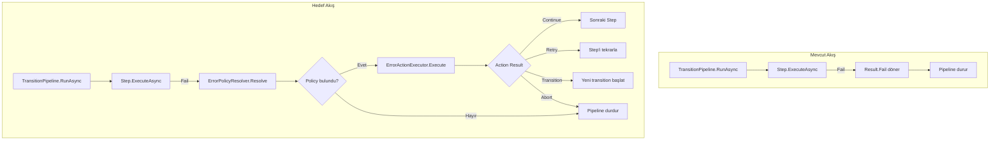

# Error Boundary Entegrasyon Planı

## Mevcut Durum Analizi

**Tamamlanan:**

- Domain modelleri (`ErrorBoundary`, `ErrorHandlerRule`, `RetryPolicy`, vb.)
- `Workflow`, `State`, `WorkflowTask`, `SubFlow` sınıflarına `ErrorBoundary` property'leri
- `ErrorPolicyResolver` - Task → State → Global hiyerarşik çözümleme
- `ErrorActionExecutor` - Abort, Retry, Rollback, Ignore, Notify, Log aksiyonları
- `ErrorBoundaryTaskCoordinator` - Task seviyesinde error handling
- `SubflowCompletionService` - SubFlow error propagation mantığı

**Eksik Olan:**

1. DI kayıtları (hiçbir error boundary servisi kayıtlı değil)
2. Pipeline seviyesinde error boundary wrapper'ı
3. Step hatalarının State/Global boundary'lerden geçmesi
4. ErrorBoundary:TransitionKey'in pipeline tarafından işlenmesi



## Implementasyon Adımları

### 1. DI Registrasyonları

[`PipelineServiceCollectionExtensions.cs`](src/BBT.Workflow.Application/Microsoft/Extensions/DependencyInjection/PipelineServiceCollectionExtensions.cs) dosyasına:

```csharp
// Error Boundary Services
services.AddSingleton<ICompiledErrorPolicyCache, CompiledErrorPolicyCache>();
services.AddScoped<IErrorPolicyResolver, ErrorPolicyResolver>();
services.AddScoped<IErrorActionExecutor, ErrorActionExecutor>();
services.AddScoped<IErrorBoundaryTaskCoordinator, ErrorBoundaryTaskCoordinator>();
```


### 2. Pipeline-Level Error Boundary Wrapper

Yeni bir `ErrorBoundaryPipelineDecorator` sınıfı oluşturulacak:**Dosya:** `src/BBT.Workflow.Application/Execution/Transitions/Pipeline/ErrorBoundaryPipelineDecorator.cs`Bu decorator:

- Step başarısızlıklarını yakalayacak
- `ErrorPolicyResolver` ile State → Global hiyerarşisinden policy çözümleyecek
- `ErrorActionExecutor` ile aksiyonu uygulayacak
- Transition action'ları için `context.Items["ErrorBoundary:TransitionKey"]` set edecek

### 3. TransitionPipeline Entegrasyonu

[`TransitionPipeline.cs`](src/BBT.Workflow.Application/Execution/Transitions/Pipeline/TransitionPipeline.cs) dosyasında `RunAsync` metodu güncellenir:

```csharp
// Mevcut:
var stepResult = await ExecuteStepAsync(state.CurrentStep, context, cancellationToken);
if (!stepResult.IsSuccess)
    return Result.Fail(stepResult.Error);

// Yeni:
var stepResult = await ExecuteStepWithErrorBoundaryAsync(
    state.CurrentStep, context, cancellationToken);
    
if (!stepResult.IsSuccess)
    return Result.Fail(stepResult.Error);
    
// Handle error boundary actions (transition, retry)
if (stepResult.Value?.ErrorActionResult != null)
{
    var actionResult = stepResult.Value.ErrorActionResult;
    if (actionResult.HasTransition)
    {
        // Queue transition via directives
        context.Directives.RequestErrorTransition(actionResult.TransitionKey);
    }
}
```


### 4. StepOutcome Genişletmesi

[`StepOutcome.cs`](src/BBT.Workflow.Application/Execution/Transitions/Pipeline/StepOutcome.cs) dosyasına:

```csharp
public ErrorActionResult? ErrorActionResult { get; init; }
```


### 5. PipelineDirectives Genişletmesi

Error transition desteği için:

```csharp
public void RequestErrorTransition(string transitionKey) { ... }
public string? ErrorTransitionKey { get; private set; }
```


### 6. HandleSubFlowStep'te SubFlow ErrorBoundary Entegrasyonu

[`HandleSubFlowStep.cs`](src/BBT.Workflow.Application/Execution/Transitions/Pipeline/Steps/HandleSubFlowStep.cs) dosyasında SubFlow başlatılırken, child workflow'dan gelecek hatalar için parent'ın `SubFlow.ErrorBoundary` ve `SubFlow.ErrorPolicy` bilgisi correlation'a eklenir.

### 7. Metrics Entegrasyonu

[`PrometheusWorkflowMetrics.cs`](src/BBT.Workflow.Infrastructure/Monitoring/PrometheusWorkflowMetrics.cs) dosyasındaki error boundary metriklerinin pipeline'dan çağrılması.

## Dosya Değişiklikleri Özeti

| Dosya | Değişiklik Tipi ||-------|----------------|| `PipelineServiceCollectionExtensions.cs` | Güncelleme (DI kayıtları) || `ErrorBoundaryPipelineDecorator.cs` | Yeni dosya || `TransitionPipeline.cs` | Güncelleme (decorator entegrasyonu) || `StepOutcome.cs` | Güncelleme (ErrorActionResult property) |