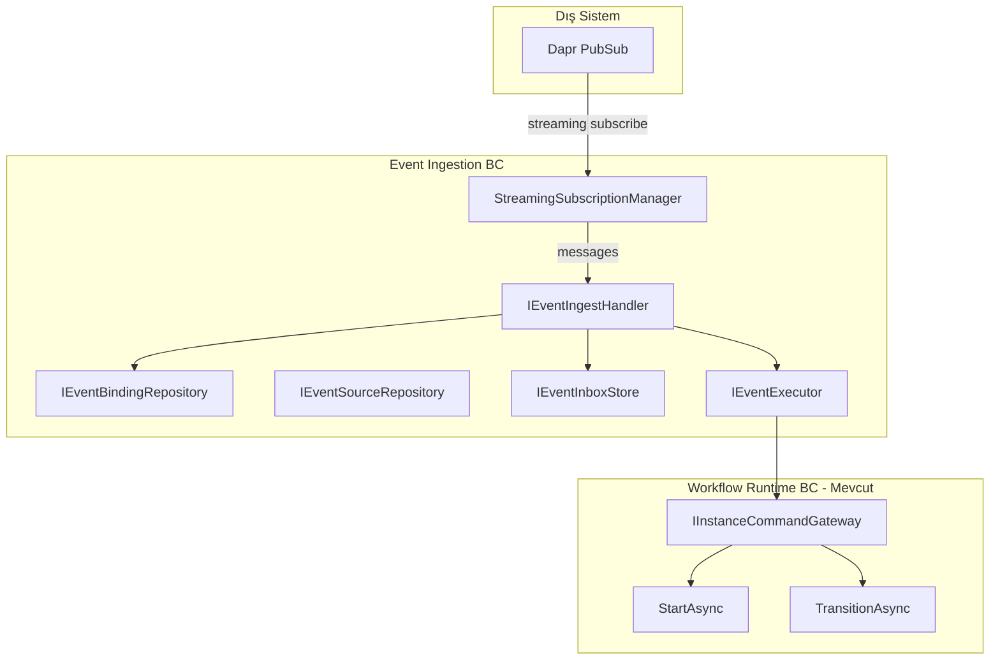
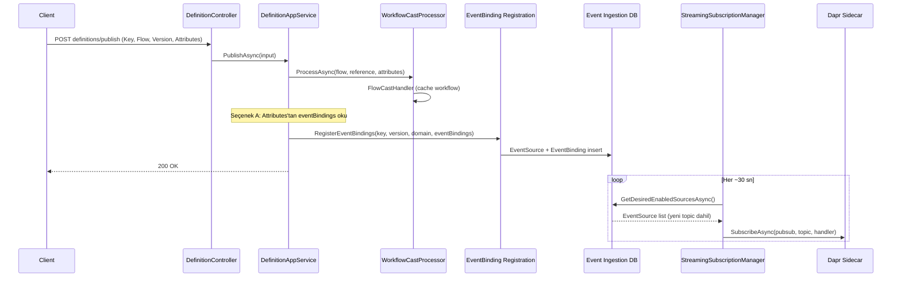
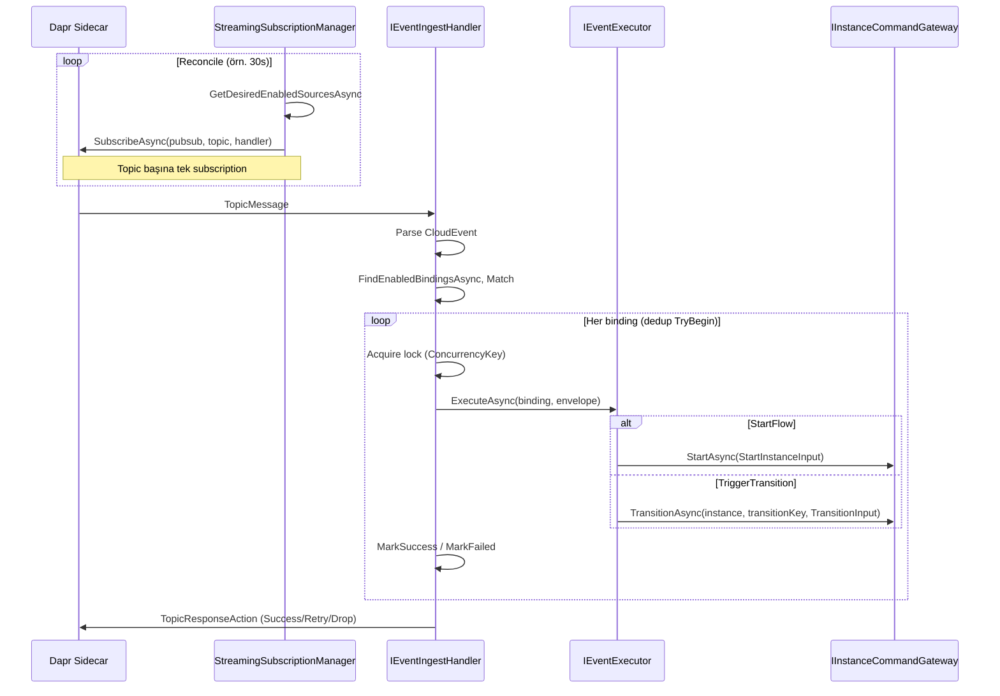
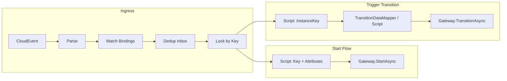

# Event-Transition ve Event Mimari Planı (Mimari Komite)

Bu plan, [ai-docs/event.md](ai-docs/event.md) içindeki konsept dokümanını vNext projesi ve Dapr SDK gerçekleriyle hizalayarak, **Dapr streaming subscription** kullanarak flow başlatma ve transition tetikleme için teknik implementasyon çerçevesini tanımlar.

---

## 1. Amaç ve Kapsam


| Hedef                      | Açıklama                                                                                                                                                                                                                                   |
| -------------------------- | ------------------------------------------------------------------------------------------------------------------------------------------------------------------------------------------------------------------------------------------ |
| **Flow-level event**       | Herhangi bir topic'e abone olup event ile **flow başlatma** (StartInstance).                                                                                                                                                               |
| **Transition-level event** | Herhangi bir topic'e abone olup event ile **transition tetikleme** (TransitionAsync).                                                                                                                                                      |
| **Instance lifecycle**     | Instance tamamlandığında veya cancel olduğunda ilgili **instance seviyesinde** abonelik etkisi sonlandırılır (ayrıntı aşağıda).                                                                                                            |
| **Standartlar**            | Topic seviyesinde ayraç; **CloudEvent** (id, type, subject, data) kullanımı.                                                                                                                                                               |
| **Mevcut altyapı**         | Lock: projede var ([AddDaprDistributedLock](src/BBT.Workflow.HttpApi.Shared/Microsoft/Extensions/DependencyInjection/WorkflowApiBaseServiceCollectionExtensions.cs)); InstanceKey ve Data maplemek için **Script Execution** kullanılacak. |


**Not:** Proje şu an Dapr **programmatic subscription** ([DaprEventDiscoveryController](workers/BBT.Workflow.Workers.Inbox/Controllers/DaprEventDiscoveryController.cs), `/dapr/subscribe`) ve `IDistributedEventBus` ile domain event'leri kullanıyor. **Streaming subscription** için Dapr .NET SDK'da `Dapr.Messaging` ve `DaprPublishSubscribeClient.SubscribeAsync` kullanılacak; bu paket projede henüz yok, eklenecek.

---

## 2. Mevcut Proje Özeti (İlgili Noktalar)

- **Start:** `POST {domain}/workflows/{workflow}/instances/start` → [InstanceCommandAppService.StartAsync](src/BBT.Workflow.Application/Instances/InstanceCommandAppService.cs), [IInstanceCommandGateway.StartAsync](src/BBT.Workflow.Application/Gateway/IInstanceCommandGateway.cs).
- **Transition:** `PATCH {domain}/workflows/{workflow}/instances/{instance}/transitions/{transitionKey}` → `TransitionAsync(instance, transitionKey, TransitionInput)`; `instance` string (Guid veya Instance.Key).
- **Script:** [IMapping](src/BBT.Workflow.Domain/Scripting/Contracts/IMapping.cs) (InputHandler/OutputHandler), [ITransitionMapping](src/BBT.Workflow.Domain/Scripting/Contracts/ITransitionMapping.cs), [ScriptContext](src/BBT.Workflow.Domain/Scripting/Models.cs) (Body, Headers, Instance, Workflow, vb.), [TransitionDataMapper](src/BBT.Workflow.Application/Execution/Transitions/Services/TransitionDataMapper.cs) transition payload mapping için.
- **Lock:** [IDistributedLockService](src/BBT.Workflow.Infrastructure/Execution/PostCommit/DistributedCacheIdempotencyStore.cs) (Aether/Dapr), [TransitionPipeline](src/BBT.Workflow.Application/Execution/Transitions/Pipeline/TransitionPipeline.cs) instance lock ile.
- **Multi-schema:** [ICurrentSchema.Use(flowName)](docs/architecture/multi-schema.md); her flow için ayrı DB şeması.
- **Instance tamamlanma/iptal:** [Instance.Complete/Cancel](src/BBT.Workflow.Domain/Instances/Instance.cs) → `InstanceCompletedCleanupEvent` / `InstanceCanceledEvent`; [InstanceCancellationService](src/BBT.Workflow.Application/Instances/Managers/InstanceCancellationService.cs) job iptali.

---

## 3. Bounded Context ve Yüksek Seviye Mimari




- **Event Ingestion BC:** EventSource registry, EventBinding (event → flow start | transition), Inbox/Dedup, streaming subscribe/unsubscribe, parse → match → dedup → lock → execute → ack.
- **Workflow Runtime BC:** Mevcut vNext; sadece `IInstanceCommandGateway.StartAsync` ve `TransitionAsync` ile etkileşim.

---

## 4. Veri Modeli (Özet)

- **EventSource:** PubSubName, Topic, Enabled, (opsiyonel Metadata).  
- **EventBinding:** EventSourceId, EventType, FilterExpr (opsiyonel), ActionKind (StartFlow | TriggerTransition), **TargetFlowKey**, **TargetFlowVersion** (flow versiyon bazlı tutulduğu için zorunlu), TargetDomain (workflow runtime için), TargetTransitionKey (transition için), CorrelationExpr (transition için zorunlu), ConcurrencyKeyExpr (önerilen), IsFanOutAllowed, Priority, Enabled.  
- **EventInbox:** EventId, BindingId, CreatedAt, CompletedAt, Status; DedupKey = EventId::BindingId.

**Versiyon:** StartInstanceInput ve TransitionInput zaten `Version` kullanıyor ([WorkflowExecutionContext](src/BBT.Workflow.Domain/Execution/Transitions/Context/WorkflowExecutionContext.cs)); EventBinding’de **TargetFlowVersion** tutulursa executor doğrudan bu versiyonu gateway çağrısına iletebilir.

Publish-time kuralları (konsept dokümandaki gibi): aynı EventSourceId + EventType için IsFanOutAllowed=false ise tek binding; TriggerTransition için CorrelationExpr zorunlu; fan-out sadece IsFanOutAllowed=true ile.

---

## 5. Event-Flow İlişkisi: Ayrı Context Seçeneği

Proje her flow için DB şeması açtığından event-flow ilişkisi iki yaklaşımla değerlendirilebilir:


| Seçenek                                               | Açıklama                                                                                                       | Artılar                                                                     | Eksiler                                                                                                                         |
| ----------------------------------------------------- | -------------------------------------------------------------------------------------------------------------- | --------------------------------------------------------------------------- | ------------------------------------------------------------------------------------------------------------------------------- |
| **A) Ayrı DbContext (Event Ingestion)**               | EventSource, EventBinding, EventInbox tek bir sabit şemada (örn. `event_ingestion`) tutulur; kendi migrations. | Flow şemalarından bağımsız; tek migration yolu; deploy basit.               | İki context; cross-schema sorgu yok.                                                                                            |
| **B) WorkflowDbContext ile aynı DB, paylaşılan şema** | Aynı veritabanında, varsayılan veya sabit bir şemada (örn. `public` veya `sys_events`) event tabloları.        | Tek context ile yönetilebilir (event tabloları aynı context’e eklenebilir). | WorkflowDbContext’in multi-schema pattern’i ile dikkat: event tabloları schema switch’ten etkilenmemeli (her zaman sabit şema). |


**Öneri:** **A) Ayrı Event Ingestion DbContext.** Event binding’ler flow’a referans verir (TargetFlowKey, domain/workflow) ama fiziksel olarak flow şemalarında değil, tek bir yerde tutulur; reconcile ve subscription yönetimi basit kalır.

---

## 6. Arayüz Seviyesi Tasarım

### 6.1 Engine Bağlantısı (Workflow Runtime’a Dokunmadan)

Mevcut gateway kullanılır; yeni bir “engine” interface’i eklenmez, doğrudan `IInstanceCommandGateway` kullanılır:

```csharp
// Mevcut - değişmez
public interface IInstanceCommandGateway
{
    Task<Result<StartInstanceOutput>> StartAsync(StartInstanceInput input, CancellationToken ct);
    Task<Result<TransitionOutput>> TransitionAsync(Guid instanceId, string transitionKey, TransitionInput input, CancellationToken ct);
}
```

TransitionAsync için `instance` tarafında mevcut API string (instance id veya key) kabul ediyor; gateway’in `TransitionAsync(Guid instanceId, ...)` overload’ı ve `InstanceController`’daki `instance` string’i ile uyum: event executor’da instance identifier’ı (Guid veya key) script’ten çıkarıp gateway’e geçmek yeterli.

### 6.2 Event Envelope (CloudEvent)

```csharp
// CloudEvent uyumlu minimum envelope
public sealed record EventEnvelope(
    string Id,
    string Type,
    string? Subject,
    object Payload,
    IReadOnlyDictionary<string, string>? Metadata);
```

Dapr’dan gelen mesaj parse edilerek CloudEvent id/type/subject/data normalize edilir.

### 6.3 Event Ingestion Repository’ler

```csharp
public interface IEventSourceRepository
{
    Task<IReadOnlyList<EventSource>> GetDesiredEnabledSourcesAsync(CancellationToken ct);
}

public interface IEventBindingRepository
{
    Task<IReadOnlyList<EventBinding>> FindEnabledBindingsAsync(Guid eventSourceId, string eventType, CancellationToken ct);
}

public interface IEventInboxStore
{
    Task<bool> TryBeginAsync(string eventId, Guid bindingId, CancellationToken ct);
    Task MarkSuccessAsync(string eventId, Guid bindingId, CancellationToken ct);
    Task MarkFailedAsync(string eventId, Guid bindingId, string error, CancellationToken ct);
}
```

### 6.4 Lock ve Ingest Handler

Mevcut lock altyapısı kullanılır; concurrency key script/expression ile üretilir:

```csharp
// Mevcut Aether/Dapr lock - aynı kalır
// IDistributedLockService.ExecuteWithLockAsync(lockKey, action, ttlSeconds, ct)

public interface IEventIngestHandler
{
    Task<TopicResponseAction> HandleAsync(EventSource source, TopicMessage message, CancellationToken ct);
}
```

Handler akışı: Parse → EventEnvelope; FindEnabledBindingsAsync → Match (FilterExpr varsa); her binding için TryBeginAsync (dedup); ConcurrencyKeyExpr/CorrelationExpr ile lockKey üret → ExecuteWithLockAsync → IEventExecutor.ExecuteAsync → MarkSuccess/MarkFailed; Success/Drop/Retry dön.

### 6.5 Event Executor (Start vs Transition)

```csharp
public interface IEventExecutor
{
    Task ExecuteAsync(EventBinding binding, EventEnvelope envelope, CancellationToken ct);
}
```

- **StartFlow:** `StartInstanceInput` (Domain, Workflow, **Version**, Instance.Key, Instance.Attributes) oluşturulur; Version EventBinding.**TargetFlowVersion**’dan alınır; Attributes ve Key script ile üretilir; `IInstanceCommandGateway.StartAsync(input, ct)` çağrılır.
- **TriggerTransition:** Instance identifier script’ten çıkarılır; `TransitionInput(domain, workflow, **version**, data, sync)` içinde **version** EventBinding.**TargetFlowVersion**’dan alınır; `TransitionAsync(instanceIdOrKey, transitionKey, input, ct)`.

Domain/Workflow/Version EventBinding’de TargetDomain, TargetFlowKey, TargetFlowVersion ile doldurulur.

---

## 7. Script Execution ile InstanceKey ve Data Mapping

- **InstanceKey (flow start):** Start için instance key (ve varsa tags) event payload’dan script ile üretilir. Mevcut **ScriptContext** benzeri bir context’e Body = event payload, Headers/Metadata konulur; yeni bir **IEventStartInputMapping** (veya tek bir script interface’inde “start” metodu) ile Key ve Attributes döndürülür.
- **InstanceKey (transition):** Transition için hangi instance’a gideceği **CorrelationExpr** (örn. JSONPath/JMESPath) veya script ile bulunur. Script çıktısı instance id (Guid) veya Instance.Key string olabilir; mevcut `TransitionAsync(instance, ...)` string kabul ettiği için doğrudan kullanılır.
- **Data mapping:** Start’ta Attributes; transition’da TransitionInput.Data. Mevcut **TransitionDataMapper** ve **ITransitionMapping** transition tarafında kullanılabilir; event payload’ı ScriptContext.Body’e koyup aynı mapping script’ini çalıştırmak yeterli. Flow start için ayrı bir “start input mapping” script’i (Attributes, Key) tanımlanır.

Önerilen script interface’leri (domain’de veya application’da):

- `IEventStartInputMapping`: InputHandler benzeri; (EventEnvelope, ScriptContext) → (InstanceKey?, Attributes JsonElement?)  
- Transition tarafında: Mevcut Transition.Mapping (ITransitionMapping) kullanılır; ScriptContext Body = event payload, Instance = hedef instance (CorrelationExpr ile bulunur).

---

## 8. Instance Seviyesinde “Abonelik Sonlandırma” Açıklaması

Dapr’da abonelik **topic** bazlıdır; “instance bazlı subscription” fiziksel olarak yoktur. Bu yüzden:

- **Topic/flow/transition seviyesi:** Bir topic’e bir kez subscribe olunur; gelen her mesaj EventBinding’lere göre ya flow start ya transition trigger üretir.
- **Instance seviyesinde sonlandırma:** Şu anlama gelir:  
  - Transition binding için event geldiğinde CorrelationExpr ile **instance** çözümlenir.  
  - Eğer bu instance zaten **Completed** veya **Canceled** ise transition tetiklenmez (veya “instance not active” nedeniyle ack/drop).  
  - Yani “abonelik” kalkmıyor; **dispatch zamanında** o instance’a artık işlem yapılmıyor. Tamamlanma/iptal event’leri (InstanceCompletedCleanupEvent, InstanceCanceledEvent) mevcut haliyle job iptali vb. yapıyor; event-ingestion tarafında ek olarak “instance X için artık transition dispatch etme” mantığı, instance durumu kontrol edilerek sağlanır.

İsteğe bağlı: Transition binding’lerde “sadece aktif instance’lar” için kuralı zorunlu kılmak ve executor’da instance durumunu (InstanceRepository ile) kontrol edip Completed/Canceled ise Skip + MarkSuccess (idempotent) yapmak.

---

## 9. Flow Deploy ve Dinamik Abonelik (Kod Seviyesi)

Bileşenler (flow dahil) **publish endpoint** ile register ediliyor: `POST api/v{version}/definitions/publish` → [DefinitionController.PublishAsync](orchestration/BBT.Workflow.Orchestration.HttpApi.Host/Controllers/Definitions/DefinitionController.cs) → [DefinitionAppService.PublishAsync](src/BBT.Workflow.Application/Definitions/DefinitionAppService.cs). PublishInput: Key, Domain, Flow, Version, Attributes (JSON). Flow deploy = bu endpoint’e flow tanımı (Attributes içinde workflow JSON) ile istek atılması.

### 9.1 EventBinding’in Kaynağı (İki Seçenek)

**Seçenek A – Publish sırasında flow tanımından:**  
Flow tanımı (Attributes) içinde opsiyonel event config (örn. `eventBindings` dizisi) bulunur. Publish akışında flow cast’ten sonra bu config okunup Event Ingestion tarafına yazılır.

- **Yer:** [DefinitionAppService](src/BBT.Workflow.Application/Definitions/DefinitionAppService.cs) içinde `SaveNewInstanceAsync` / `HandleExistingInstanceAsync` sonrası, veya yeni bir **IWorkflowCastHandler** implementasyonu (örn. **EventBindingFlowCastHandler**).
- **Cast handler kullanılırsa:** [WorkflowCastProcessor](src/BBT.Workflow.Application/Definitions/CastHandlers/WorkflowCastProcessor.cs) flow için uygun handler’ı seçiyor; [FlowCastHandler](src/BBT.Workflow.Application/Definitions/CastHandlers/FlowCastHandler.cs) sadece cache’e workflow yazıyor. Event binding’leri yazmak için:
  - Ya **FlowCastHandler**’dan sonra çalışacak ayrı bir adım (DefinitionAppService’te castProcessor.ProcessAsync sonrası): Attributes’tan `eventBindings` varsa parse et, EventSource/EventBinding’leri Event Ingestion DbContext ile kaydet (aynı transaction’da değil; Event Ingestion ayrı context).
  - Ya da **EventBindingFlowCastHandler** gibi ikinci bir handler: `CanHandle("sys-flows")` döner mi dönmez mi diye düşünmek gerekir; şu an tek handler sys-flows için. Daha temiz olan: DefinitionAppService içinde cast işleminden sonra, flow ise (input.Flow == RuntimeSysSchemaInfo.Flows) Attributes’tan event config’i okuyup **IEventBindingRegistrationService** (veya doğrudan Event Ingestion repo) ile kaydetmek.

**Seçenek B – Ayrı API:**  
Event binding’ler ayrı endpoint ile (örn. `POST api/v1/event-bindings`) kaydedilir. Deploy pipeline veya UI önce `POST definitions/publish`, sonra gerekirse `POST event-bindings` çağırır. Dinamik abonelik davranışı aynıdır: binding’ler DB’de olduğu sürece bir sonraki reconcile’da topic’e subscribe olunur.

### 9.2 Dinamik Abonelik Nasıl Çalışıyor (Kod)

Abonelik **reconcile döngüsü** ile dinamik; Dapr’a doğrudan “flow deploy” event’i göndermeye gerek yok.

1. **StreamingSubscriptionManager** (BackgroundService) periyodik çalışır (örn. her 30 sn):

```csharp
protected override async Task ExecuteAsync(CancellationToken stoppingToken)
{
    while (!stoppingToken.IsCancellationRequested)
    {
        await ReconcileAsync(stoppingToken);
        await Task.Delay(TimeSpan.FromSeconds(30), stoppingToken);
    }
}
```

1. **ReconcileAsync** – istenen topic listesi DB’den alınır; eksikler subscribe, fazlalar dispose edilir:

```csharp
private async Task ReconcileAsync(CancellationToken ct)
{
    var desired = await _eventSourceRepository.GetDesiredEnabledSourcesAsync(ct);
    var desiredKeys = desired.Select(s => Key(s.PubSubName, s.Topic)).ToHashSet();

    foreach (var src in desired)
    {
        var k = Key(src.PubSubName, src.Topic);
        if (_active.ContainsKey(k)) continue;

        var sub = await _daprPubSubClient.SubscribeAsync(
            src.PubSubName,
            src.Topic,
            options: new DaprSubscriptionOptions(...),
            handler: (msg, token) => _ingestHandler.HandleAsync(src, msg, token),
            cancellationToken: ct);
        _active[k] = sub;
    }

    foreach (var kvp in _active.ToArray())
    {
        if (desiredKeys.Contains(kvp.Key)) continue;
        if (_active.TryRemove(kvp.Key, out var sub))
            await sub.DisposeAsync();
    }
}

private static string Key(string pubsub, string topic) => $"{pubsub}::{topic}";
```

1. **GetDesiredEnabledSourcesAsync** – “Hangi topic’lere abone olmalıyız?” sorusunun cevabı: **en az bir enabled EventBinding’e referans veren** EventSource’lar:

```csharp
// IEventSourceRepository implementasyonu (Event Ingestion DbContext kullanır)
public async Task<IReadOnlyList<EventSource>> GetDesiredEnabledSourcesAsync(CancellationToken ct)
{
    return await _db.Set<EventSource>()
        .Where(es => es.Enabled && _db.Set<EventBinding>().Any(eb =>
            eb.EventSourceId == es.Id && eb.Enabled))
        .Distinct()
        .ToListAsync(ct);
}
```

Yani flow deploy (veya ayrı API) ile EventSource + EventBinding kayıtları yazıldığı anda, **bir sonraki ReconcileAsync** çalıştığında o topic listede olacak ve `SubscribeAsync` ile abonelik açılacak. Ekstra “deploy event” veya anında tetikleme gerekmez; periyodik reconcile yeterli.

### 9.3 Flow Deploy → Dinamik Abonelik Akışı (Özet)




### 9.4 Publish Akışına Event Binding Kaydı Ekleme (Seçenek A – Özet)

- **DefinitionAppService.PublishAsync** içinde, `castProcessor.ProcessAsync(...)` çağrısından sonra:
  - `input.Flow == RuntimeSysSchemaInfo.Flows` ise (flow deploy), Attributes’tan event config çıkar (örn. `eventBindings` array).
  - Her bir binding için EventSource (pubsub + topic) yoksa oluştur / getir; EventBinding ekle (TargetFlowKey = input.Key, **TargetFlowVersion = input.Version**, TargetDomain = input.Domain, EventType, ActionKind, vb.).
  - Event Ingestion DbContext ile **SaveChangesAsync** (ayrı context, ayrı transaction).
- Böylece “flow deploy edildiğinde” binding’ler otomatik yazılır; bir sonraki reconcile’da ilgili topic’e streaming subscription açılır.

---

## 10. Dapr Streaming Subscription Akışı




---

## 11. Akış Özeti (Flow Start vs Transition)




---

## 12. Uygulama Adımları (Özet)

1. **Event Ingestion veri modeli ve persistence**
  EventSource, EventBinding (içinde **TargetFlowVersion**, TargetDomain, TargetFlowKey), EventInbox entity’leri; **ayrı EventIngestionDbContext** ve migrations (tek sabit şema).
2. **Dapr.Messaging entegrasyonu**
  `Dapr.Messaging` paketi; `DaprPublishSubscribeClient`; HostedService ile **StreamingSubscriptionManager** (GetDesiredEnabledSourcesAsync ile reconcile, SubscribeAsync/Dispose).
3. **CloudEvent parse ve EventIngestHandler**
  Dapr TopicMessage → EventEnvelope; IEventBindingRepository, IEventInboxStore, IDistributedLockService kullanımı; TopicResponseAction dönüşü.
4. **IEventExecutor implementasyonu**
  Start: script ile StartInstanceInput (Key, Attributes); Gateway.StartAsync. Transition: script ile instance id/key; TransitionInput + mevcut TransitionDataMapper/script; Gateway.TransitionAsync. Domain/Workflow binding’den.
5. **Script arayüzleri**
  IEventStartInputMapping (Key, Attributes); transition tarafında CorrelationExpr/script ile instance çözümleme ve mevcut ITransitionMapping kullanımı.
6. **Publish-time validasyon**
  Binding kaydederken determinism kuralları (tek non-fan-out per EventSourceId+EventType; TriggerTransition için CorrelationExpr zorunlu).
7. **Instance durumu kontrolü (transition)**
  Executor’da transition tetiklemeden önce instance’ın Active olup olmadığını kontrol; Completed/Canceled ise skip (idempotent ack).
8. **Logging ve metrik**
  WorkflowLogs’a event-ingestion için extension’lar; Dapr pubsub receive metrikleri (mevcut PrometheusWorkflowMetrics ile uyumlu).
9. **Flow deploy → event binding (opsiyonel)**
  Publish akışında flow için Attributes’tan event config okuyup Event Ingestion’a EventSource/EventBinding yazan adım (veya ayrı event-bindings API); böylece deploy = binding kaydı = bir sonraki reconcile’da dinamik subscribe.

Bu plan, konsept dokümanındaki EventSource/EventBinding/Inbox/Lock/Executor modelini koruyup, **versiyon bazlı EventBinding** (TargetFlowVersion), **publish endpoint ile bileşen register** ve **reconcile ile dinamik streaming abonelik** kod detaylarıyla birlikte tanımlar. Event-flow ilişkisi için ayrı context (Event Ingestion DbContext) önerilir; mimari komite onayına sunulabilir.