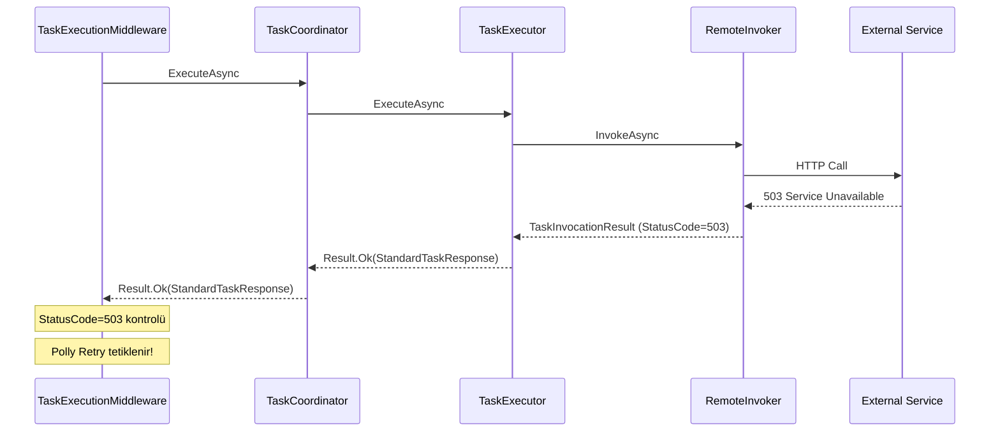

# TaskCoordinator Response Refactoring

## Mimari Değişiklik




## Değişiklikler

### 1. ITaskCoordinator Interface Güncelleme

[`src/BBT.Workflow.Application/Tasks/ITaskCoordinator.cs`](src/BBT.Workflow.Application/Tasks/ITaskCoordinator.cs)

```csharp
// Mevcut:
Task<Result> ExecuteAsync(...);

// Yeni:
Task<Result<IReadOnlyList<StandardTaskResponse>>> ExecuteAsync(...);
```


### 2. TaskCoordinator Implementasyonu

[`src/BBT.Workflow.Application/Tasks/Coordinator/TaskCoordinator.cs`](src/BBT.Workflow.Application/Tasks/Coordinator/TaskCoordinator.cs)

- `ExecuteAsync()` → `Result<IReadOnlyList<StandardTaskResponse>>` dönsün
- `ExecuteTaskAsync()` → `Result<StandardTaskResponse>` dönsün
- Response collection'ı biriktirip dönsün

### 3. TaskResiliencePipelineFactory Güncelleme

[`src/BBT.Workflow.Application/Tasks/Resilience/TaskResiliencePipelineFactory.cs`](src/BBT.Workflow.Application/Tasks/Resilience/TaskResiliencePipelineFactory.cs)Yeni metod ekle:

```csharp
ResiliencePipeline<Result<StandardTaskResponse>> CreateStandardResponsePipeline(
    string taskKey,
    RetryPolicy? errorBoundaryPolicy = null);
```

`ShouldRetry` predicate:

- `Result.IsSuccess == false` → retry
- `StandardTaskResponse.StatusCode` retryable ise → retry
- `StandardTaskResponse.IsSuccess == false` → retry

### 4. TaskExecutionMiddleware Güncelleme

[`src/BBT.Workflow.Application/Tasks/Coordinator/TaskExecutionMiddleware.cs`](src/BBT.Workflow.Application/Tasks/Coordinator/TaskExecutionMiddleware.cs)

- `CreateStandardResponsePipeline()` kullan
- StatusCode ve IsSuccess kontrolü artık Polly içinde otomatik
- ErrorBoundary için `StandardTaskResponse` bilgilerini kullan

### 5. ITaskResiliencePipelineFactory Interface Güncelleme

[`src/BBT.Workflow.Application/Tasks/Resilience/ITaskResiliencePipelineFactory.cs`](src/BBT.Workflow.Application/Tasks/Resilience/ITaskResiliencePipelineFactory.cs)Yeni interface metodu ekle.

## Etkilenen Dosyalar