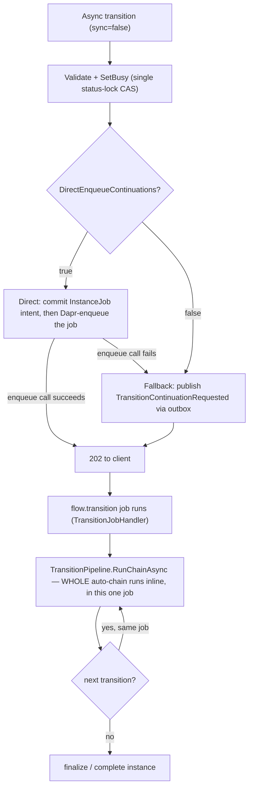

# Async Transition Execution Modes

## Purpose

Async transition execution (`sync=false`) has exactly **one** live `WorkflowExecution`
configuration flag: `DirectEnqueueContinuations`. It governs how the *initial* job for an
async accept (a start or a manual/event transition) is enqueued — direct Dapr enqueue with
an outbox fallback, or always through the transactional outbox. It does **not** govern
per-hop continuations inside an auto-chain: those always run in-process now, never as a
separate enqueue. This page documents that flag, why the auto-chain has no configuration
surface any more, and what happened to the three flags this document used to describe.

`sync=true` requests bypass jobs entirely — the pipeline runs in-process and the response
carries the full instance — so none of this applies to synchronous calls.

## Configuration

```jsonc
"WorkflowExecution": {
  "TransitionJobTimeoutSeconds": 300,
  "TransitionPerJob": true,             // legacy; bound for compatibility, ignored by execution
  "DirectEnqueueContinuations": true,   // initial-accept enqueue path only (default: true)
  "FailurePolicy": { "MaxRetries": 5, "IntervalSeconds": 30 }
}
```

Source of record:
`src/BBT.Workflow.Application/BackgroundJobs/Options/WorkflowExecutionOptions.cs`.

| Flag | `true` (default) | `false` |
| --- | --- | --- |
| `DirectEnqueueContinuations` | The **initial** async-accept job is enqueued DIRECTLY via `ITransitionJobEnqueuer` (no outbox/inbox poll hop) — lower latency. If the direct Dapr enqueue call fails, `TransitionEnqueueGateway` falls back to publishing a `TransitionContinuationRequested` event through the transactional outbox, so durability is preserved either way. | The continuation is always published through the transactional outbox (legacy path); the Inbox worker forwards it and Orchestration performs the real Dapr enqueue — fully transactional, at the cost of the outbox/inbox poll hop. |
| `TransitionPerJob` | No effect. Retained only so existing `appsettings.json`/environment bindings do not fail; execution never reads it to change behavior. | No effect (same as `true`). |

The durable `InstanceJob` intent row is inserted in the ambient transition unit of work in
both `DirectEnqueueContinuations` modes — a Dapr job can never exist without a tracking
intent, and a crash in the commit→enqueue window degrades to the outbox fallback rather
than an orphaned job.

## What used to be here

Earlier drafts of this document (and of the runtime itself) described a four-flag surface:
`UseOutboxContinuations`, `TransitionPerJob` as a real switch, `StrictChainTokenGate`, and
`EnableChainReaper` — with a `ChainReaperService` watchdog and `ChainToken` /
`ChainHeartbeat` / `ResumePoint` instance columns backing the concurrency gate and stuck-Busy
recovery. That design was implemented at the schema level
(`20260611200135_Instance_LockChainToken`) and then fully reverted before it shipped as
documented behavior (`20260810181548_DropInstanceChainTokenColumns`,
`20260812053101_DropInstanceResumePointColumn`) — those migrations are the only remaining
trace of it. None of `ChainToken`, `ChainReaperService`, `StrictChainTokenGate`, or
`EnableChainReaper` exist in current code. The concurrency gate today is the plain Busy
status flip described in [`.claude/rules/vnext-workflow-developer.md`](../../.claude/rules/vnext-workflow-developer.md)
§ "Locking — one lock, at the status change": a distributed lock is held only for the
Active↔Busy check-and-set itself, never across the pipeline body.

Separately, the auto-chain used to be switchable between **transition-per-job** (each hop
its own job, via `EnqueueContinuationStrategy`/`ContinuationMode.Enqueue`) and **monolithic
inline** (the whole chain in one job). That switch is gone too:
`EnqueueContinuationStrategy` still exists as a class but is no longer registered in DI
(`PipelineServiceCollectionExtensions`), so `ContinuationMode.Enqueue` is unreachable —
`ContinuationDispatcher` only ever resolves `InlineContinuationStrategy`. Every automatic
continuation now runs in-process, awaited by whichever caller or job started the chain.
`TransitionPerJob` was the flag that used to select the per-job path; it is bound from
config for compatibility and otherwise inert.

## Architecture Flow



Once the job starts, there is no branching left to configure: `RunChainAsync` walks the
auto-chain hop by hop inside the same pipeline invocation, job and UoW until it reaches a
post-commit boundary or a state with no automatic transition,
a finish state, or a Busy rest point (open SubFlow correlation, unmet auto-gate, Busy
subtype). See [Trace Lanes](../runtime/trace-lanes.md) for how these hops render as
siblings, not nested spans, in one trace, and
[`.claude/rules/vnext-workflow-developer.md`](../../.claude/rules/vnext-workflow-developer.md)
§ "Activation episode" for how the request-to-rest-point duration is measured across them.

## Failure Modes

| Crash point | Behavior |
| --- | --- |
| Direct enqueue call itself fails | `TransitionEnqueueGateway` falls back to the outbox event in the same call — no orphaned intent, no lost continuation. |
| Deferred arm (`ArmAsync`, after the accept's commit, outside the status lock) fails | The accept **falls back to the transactional outbox**: it publishes the same continuation event (`PublishOutboxFallbackAsync`) so the Inbox relay re-arms the identical job (idempotent by job name), the instance stays Busy until it does, and the request still returns 202. The flip is **not** released — an arm failure is ambiguous (the scheduler may have registered the job before the client saw the error), and releasing while the job is live server-side would break single-owner-Busy (a re-delivered job runs `IsPreReserved` with no re-check). This is finding AB-17's own remedy (c). With reference-only payloads the arm message is always small, so this path is reached only by genuine scheduler/infra failures, never by an oversized body. `TransitionJobArmFailedFellBackToOutbox` (10175) is the signal; `TransitionJobArmOutboxFallbackFailed` (10177) means the outbox publish also failed (scheduler AND DB down) and the instance stays Busy for manual recovery — no double-owner, because nothing was released. |
| Process crashes between the accept's commit and the arm | The residual window neither the fallback nor a release can cover: the committed row has no armed job and no code left to run. Same manual-intervention posture as the row below. |
| Commit succeeds, before/during Dapr enqueue | The durable `InstanceJob` intent is already committed; nothing re-arms a lost job automatically (there is no reaper) — this is the same manual-intervention posture `EnableChainReaper=false` had before, now the only posture. |
| Job killed mid-chain | The Dapr job retry re-runs the job from its start; the active-job guard (keyed by job name) and the transition record's duplicate-key guard keep re-delivery idempotent. There is no per-hop checkpoint to resume from — a killed job re-executes whatever hops had not yet committed. |
| Instance already Busy, new request arrives | Rejected by the plain Busy gate; cancel/exit/timeout/updateData are exempt by design (see the Locking section referenced above), not by any chain-ownership token. |

At-least-once delivery means the transition job and its downstream handlers must stay
idempotent regardless of which enqueue path was taken.

## Reference-Only Job Payloads (Large Bodies)

A **small** async transition body (at or below
`WorkflowExecution:AsyncTransitionInlineBodyMaxBytes`, 1 MiB by default) travels inline in
the Dapr job payload, exactly as before. A **larger** body is offloaded: it is persisted in
its own table `InstanceJobRequestData` (jsonb, keyed by the job id) at accept, and the Dapr
payload and the outbox continuation event carry `DataInJobRow: true` + the `JobId` instead of
the body. `TransitionJobHandler` hydrates it back from the table before rebuilding the
`TransitionInput`. Scheduled-transition timer payloads always had this reference-only shape.

Why offload only large bodies, and to a separate table:

- **The scheduler transport has a hard ceiling.** Dapr stores one-shot jobs in etcd, which
  refuses messages over ~2 MiB — while Kestrel accepts request bodies up to 10 MB. A body in
  the payload was refused **at arm time**, after the Busy flip and job row had committed,
  leaving the instance durably Busy with no incident; on the observed Dapr build the oversized
  job also stopped the scheduler for every domain until a restart (finding AB-17,
  [vnext-client-sdk-core#58](https://github.com/burgan-tech/vnext-client-sdk-core/issues/58)).
- **A separate table keeps hot reads blob-free.** `InstanceJob` is read metadata-only on hot
  paths — the state function's scheduled-transition listing, the updateData continuation
  handoff, cancellation. A body column on `InstanceJob` would be transferred by all of them; a
  separate table with no navigation from `InstanceJob` is loaded only by the handler's
  by-id point read.
- **Keeping small bodies inline preserves rolling-upgrade safety.** During a multi-replica
  deploy, a not-yet-upgraded pod's handler has no hydrate branch and would run a
  `DataInJobRow` job with an empty body. Because only bodies above the inline cap are
  offloaded, the overwhelming majority of transitions (small bodies) stay inline and are
  unaffected; the mixed-version window touches only genuinely oversized bodies, which were
  **100% broken** before this fix anyway (durable stuck-Busy).

Compatibility: an in-flight payload from a build that predates the fix carries `Data` inline
and the handler honors it. The reverse — a new offloaded (`DataInJobRow`) payload consumed by
an old build — runs the transition **bodyless**; drain async transition jobs before rolling
the runtime back past the `AddInstanceJobRequestDataTable` migration, and prefer draining
during a forward rolling deploy too (keep the inline cap high so ordinary transitions are
never affected). A payload that declares `DataInJobRow` whose row is missing is a hard error:
the handler routes the instance through recovery (`JOB_REQUEST_DATA_MISSING`) rather than
silently running a schema-validated request without its body. Pinned by
`AsyncTransitionStrategyTests` (inline vs offload, arm-failure outbox fallback) and
`TransitionJobHandlerTests` (hydration, missing row, legacy inline payloads).

## Observability

- `TransitionEnqueued`, `TransitionJobAlreadyQueued`, `InstanceSetBusyForAsyncTransition` on
  the accept path.
- `TransitionContinuationReceived` / `TransitionContinuationEnqueued` /
  `TransitionContinuationFellBackToOutbox` around `TransitionEnqueueGateway`'s routing
  decision — the fallback log line is the signal that the direct path failed for a given
  accept.
- Each Dapr job payload carries the trace/lane context (`TraceRoot`, `ParentTraceRoot`,
  `LaneSeq`, the activation-episode fields); spans are tagged with
  domain/flow/version/instance/transition/job for correlation. See
  [Trace Lanes](../runtime/trace-lanes.md).

## Change Safety

- `DirectEnqueueContinuations` is switchable independently and defaults to `true`; flipping
  it changes only how the *initial* job is enqueued, never whether the auto-chain runs
  inline (it always does).
- `TransitionPerJob` can be left in config (old deployments still have it set) with no
  behavioral effect — it is not an error to set it, it is simply ignored.
- No schema change is associated with either flag; the `ChainToken` / `ChainHeartbeat` /
  `ResumePoint` columns referenced by earlier drafts of this document were added and then
  dropped by migration, and nothing in current code depends on them.

## References

- `src/BBT.Workflow.Application/Execution/Transitions/Strategy/AsyncTransitionStrategy.cs`
  — validation, SetBusy, the initial accept's enqueue.
- `src/BBT.Workflow.Application/Execution/Transitions/Continuations/TransitionEnqueueGateway.cs`,
  `ITransitionEnqueueGateway.cs` — the direct-vs-outbox routing decision.
- `src/BBT.Workflow.Application/BackgroundJobs/TransitionJobEnqueuer.cs`,
  `ITransitionJobEnqueuer.cs` — the direct Dapr enqueue call.
- `src/BBT.Workflow.Application/Execution/Transitions/Continuations/InlineContinuationStrategy.cs`
  — the only registered continuation strategy; every automatic hop runs through this.
- `src/BBT.Workflow.Application/Execution/Transitions/Continuations/EnqueueContinuationStrategy.cs`
  — kept as a class, no longer registered in DI; `ContinuationMode.Enqueue` is unreachable.
- `src/BBT.Workflow.Application/Execution/Transitions/Pipeline/TransitionPipeline.cs`
  — `RunChainAsync`, the inline auto-chain loop.
- `src/BBT.Workflow.Application/BackgroundJobs/Handlers/TransitionJobHandler.cs`
  — the job entry point that runs the chain.
- [Workflow Execution Pipeline](workflow-execution-pipeline.md) — the per-transition step order.
- [Inline Auto-Chain Context Reuse](inline-chain-context-reuse.md) — how successive in-process
  hops build their `TransitionExecutionContext` without re-loading the instance/workflow.
- [Async/Durability Refactor — Required EF Core Migrations](../async-durability-refactor-MIGRATIONS.md)
  — historical draft for the `ChainToken`/`ChainHeartbeat`/`ResumePoint` design above; the
  columns it describes were later dropped and never shipped as documented behavior.
