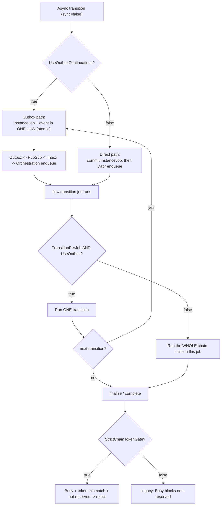
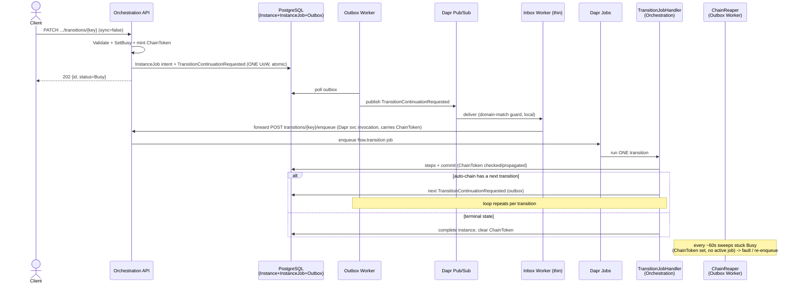
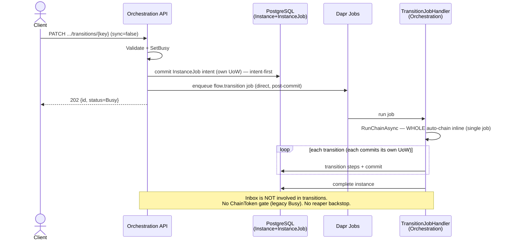

# Async Transition Execution Modes

## Purpose

Async transition execution (`sync=false`) is governed by four `WorkflowExecution`
configuration flags. Together they select how a transition's continuation is enqueued,
how an auto-chain is split into jobs, how concurrent transitions are gated, and whether a
watchdog recovers stuck instances. This page documents the end-to-end behavior of each
flag and the two canonical configurations (all-on and all-off), so operators can choose a
profile and developers can reason about latency, durability, and failure modes.

`sync=true` requests bypass jobs entirely — the pipeline runs in-process and the response
carries the full instance — so these flags do not apply to synchronous calls.

## Configuration

```jsonc
"WorkflowExecution": {
  "TransitionJobTimeoutSeconds": 300,
  "UseOutboxContinuations": true,   // continuation enqueue atomicity model
  "TransitionPerJob": true,         // one transition per job vs whole chain per job
  "StrictChainTokenGate": true,     // chain-ownership concurrency gate
  "EnableChainReaper": true,        // stuck-Busy watchdog
  "FailurePolicy": { "MaxRetries": 5, "IntervalSeconds": 30 }
}
```

Source of record:
`src/BBT.Workflow.Application/BackgroundJobs/Options/WorkflowExecutionOptions.cs`.

| Flag | `true` | `false` (default) |
| --- | --- | --- |
| `UseOutboxContinuations` | Continuation is enqueued through the transactional **outbox**: the durable `InstanceJob` intent and a `TransitionContinuationRequested` event commit in one unit of work; the Outbox worker publishes it, the Inbox forwards it to Orchestration, which enqueues the Dapr job. Fully transactional, at the cost of the outbox/inbox poll hops. | **Intent-first direct enqueue**: Orchestration commits the `InstanceJob` intent in its own unit of work, then enqueues the Dapr job. A Dapr job can never exist without a tracking intent; a crash in the commit→enqueue window is recovered by the ChainReaper. Lower latency. |
| `TransitionPerJob` | Each transition runs as its own job/unit of work and enqueues the next continuation per hop — a durable per-transition checkpoint. Effective only when `UseOutboxContinuations` is also `true`. | The whole auto-chain runs inline inside a single job (monolithic). |
| `StrictChainTokenGate` | While an instance is Busy, a transition that does not carry the matching `ChainToken` and is not a reserved transition (cancel/exit/timeout/subflow-resume/shared) is rejected. | Legacy gate: Busy blocks every non-reserved transition; no token matching. |
| `EnableChainReaper` | A watchdog (in the Outbox worker) periodically sweeps Busy instances that hold a `ChainToken` but have no active `InstanceJob`, and faults or re-enqueues them. | No backstop; a stuck-Busy instance remains until manual intervention. |

> `TransitionPerJob` is gated on `UseOutboxContinuations`
> (`EnqueueContinuations = TransitionPerJob && UseOutboxContinuations`). The mixed
> combinations are described in [Mode Combinations](#mode-combinations).

## Architecture Flow

### Routing decision



### Profile A — all flags `true` (outbox + transition-per-job + strict gate + reaper)



### Profile B — all flags `false` (direct enqueue + monolithic chain, no gate/reaper)



## Execution Mode Matrix

### Profile A vs Profile B

| Aspect | A (all `true`) | B (all `false`) |
| --- | --- | --- |
| Continuation transport | outbox → pubsub → inbox → orchestration | direct Dapr enqueue |
| Hops to first execution | ~4 (outbox poll, pubsub, inbox, enqueue) | 1 (direct) |
| Latency | higher (poll intervals) | low |
| Atomicity | fully transactional (no orphan) | intent-first + reaper (no orphan) |
| Chain execution | transition-per-job (many jobs) | one job for the whole chain |
| Crash granularity | resume from last committed transition | job retry re-runs the chain |
| Throughput / interleaving | high (jobs interleave across instances) | lower (chain holds one job/lock) |
| Inbox involved in transitions | yes (continuation forward) | no |
| Concurrency safety | strict ChainToken gate | legacy Busy gate |
| Stuck-Busy recovery | ChainReaper, automatic | manual |
| Lock duration | short (per-job) | chain length |
| Operational complexity | higher (4 components active) | lower (2 components) |

### Mode Combinations

| `UseOutboxContinuations` | `TransitionPerJob` | Resulting behavior |
| --- | --- | --- |
| `true` | `true` | **Profile A**: outbox-routed, transition-per-job (durable, high throughput, higher latency) |
| `true` | `false` | Single outbox-routed kick, but the chain runs inline in one job (no per-hop continuation) |
| `false` | `true` | `TransitionPerJob` has **no effect** → direct enqueue + inline chain (behaves like B) |
| `false` | `false` | **Profile B**: direct enqueue, monolithic inline chain (fast, simple) |

## Failure Modes

| Crash point | A (all `true`) | B (all `false`) |
| --- | --- | --- |
| After a transition commit, before the next enqueue | next continuation is committed in the outbox → redelivered at-least-once | not applicable (monolithic — no intermediate enqueue) |
| Enqueue succeeded, commit failed | impossible (single UoW) | impossible (intent-first: commit precedes enqueue) |
| Job killed mid-chain | resumes from the last committed transition (per-job) | Dapr job retry re-runs the chain from the job start (active-job guard + idempotency mitigate) |
| Foreign transition while Busy | rejected by the ChainToken gate | rejected by the Busy gate (reserved transitions exempt) |
| Stuck Busy (job lost) | ChainReaper faults / re-enqueues | **no recovery** (manual) |

At-least-once delivery means downstream handlers and the transition job must stay
idempotent. The active-`InstanceJob` guard (keyed by job name) and the duplicate-key guard
on the transition record provide that protection in both profiles.

## Observability

- `TransitionEnqueued`, `TransitionJobAlreadyQueued`, `InstanceSetBusyForAsyncTransition`
  on the enqueue path.
- `TransitionContinuationReceived` / `TransitionContinuationEnqueued` on the Inbox forwarder
  (Profile A only).
- `ForeignChainTransitionRejected` when the strict ChainToken gate denies a transition.
- ChainReaper sweep logs when stuck-Busy instances are faulted or re-enqueued.
- Each Dapr job carries the trace context (`TraceParent`/`TraceState`); spans are tagged
  with domain/flow/version/instance/transition/job for correlation across the hops.

## Change Safety

- All four flags are independently switchable and default to `false` — a deployment can
  enable the outbox/per-job/gate/reaper profile incrementally and roll back per flag.
- Switching `UseOutboxContinuations` does not require a schema change; both code paths are
  always compiled. The `ChainToken` / `ChainHeartbeat` / `ResumePoint` columns the gate and
  reaper rely on are additive (see the migrations note below).
- Enabling `TransitionPerJob` without `UseOutboxContinuations` is a no-op, not an error.
- The strict gate is conservative: reserved transitions (cancel/exit/timeout/subflow-resume/
  shared) are always accepted, so cancellation paths are never blocked by chain ownership.

## References

- `src/BBT.Workflow.Application/Execution/Transitions/Strategy/AsyncTransitionStrategy.cs`
  — validation, SetBusy, outbox vs intent-first enqueue.
- `src/BBT.Workflow.Application/BackgroundJobs/Handlers/TransitionJobHandler.cs`
  — per-job vs inline-chain execution.
- `src/BBT.Workflow.Application/BackgroundJobs/ITransitionJobEnqueuer.cs`
  — shared `flow.transition` enqueue.
- `src/BBT.Workflow.Application/Execution/Transitions/Pipeline/Steps/SetBusyStep.cs`,
  `HandleCancelPreflightStep.cs` — ChainToken mint and gate.
- `src/BBT.Workflow.Application/BackgroundJobs/Recovery/ChainReaperService.cs`
  — stuck-Busy watchdog.
- `workers/BBT.Workflow.Workers.Inbox/Forwarding/` — thin forwarder to Orchestration.
- [Workflow Execution Pipeline](workflow-execution-pipeline.md) — the per-transition step order.
- [Async/Durability Refactor — Required EF Core Migrations](../async-durability-refactor-MIGRATIONS.md).
