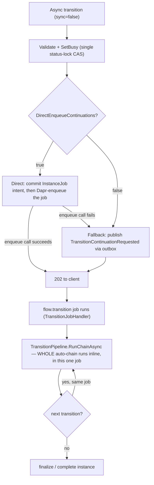

# Async Transition Execution Modes

## Purpose

Async transition execution (`sync=false`) has exactly **one** live `WorkflowExecution`
configuration flag: `DirectEnqueueContinuations`. It governs how the *initial* job for an
async accept (a start or a manual/event transition) is enqueued — direct Dapr enqueue with
an outbox fallback, or always through the transactional outbox. It does **not** govern
per-hop continuations inside an auto-chain: those always run in-process now, never as a
separate enqueue. This page documents that flag, why the auto-chain has no configuration
surface any more, and what happened to the three flags this document used to describe.

`sync=true` requests bypass jobs entirely — the pipeline runs in-process and the response
carries the full instance — so none of this applies to synchronous calls.

## Configuration

```jsonc
"WorkflowExecution": {
  "TransitionJobTimeoutSeconds": 300,
  "TransitionPerJob": true,             // legacy; bound for compatibility, ignored by execution
  "DirectEnqueueContinuations": true,   // initial-accept enqueue path only (default: true)
  "FailurePolicy": { "MaxRetries": 5, "IntervalSeconds": 30 }
}
```

Source of record:
`src/BBT.Workflow.Application/BackgroundJobs/Options/WorkflowExecutionOptions.cs`.

| Flag | `true` (default) | `false` |
| --- | --- | --- |
| `DirectEnqueueContinuations` | The **initial** async-accept job is enqueued DIRECTLY via `ITransitionJobEnqueuer` (no outbox/inbox poll hop) — lower latency. If the direct Dapr enqueue call fails, `TransitionEnqueueGateway` falls back to publishing a `TransitionContinuationRequested` event through the transactional outbox, so durability is preserved either way. | The continuation is always published through the transactional outbox (legacy path); the Inbox worker forwards it and Orchestration performs the real Dapr enqueue — fully transactional, at the cost of the outbox/inbox poll hop. |
| `TransitionPerJob` | No effect. Retained only so existing `appsettings.json`/environment bindings do not fail; execution never reads it to change behavior. | No effect (same as `true`). |

The durable `InstanceJob` intent row is inserted in the ambient transition unit of work in
both `DirectEnqueueContinuations` modes — a Dapr job can never exist without a tracking
intent, and a crash in the commit→enqueue window degrades to the outbox fallback rather
than an orphaned job.

## What used to be here

Earlier drafts of this document (and of the runtime itself) described a four-flag surface:
`UseOutboxContinuations`, `TransitionPerJob` as a real switch, `StrictChainTokenGate`, and
`EnableChainReaper` — with a `ChainReaperService` watchdog and `ChainToken` /
`ChainHeartbeat` / `ResumePoint` instance columns backing the concurrency gate and stuck-Busy
recovery. That design was implemented at the schema level
(`20260611200135_Instance_LockChainToken`) and then fully reverted before it shipped as
documented behavior (`20260810181548_DropInstanceChainTokenColumns`,
`20260812053101_DropInstanceResumePointColumn`) — those migrations are the only remaining
trace of it. None of `ChainToken`, `ChainReaperService`, `StrictChainTokenGate`, or
`EnableChainReaper` exist in current code. The concurrency gate today is the plain Busy
status flip described in [`.claude/rules/vnext-workflow-developer.md`](../../.claude/rules/vnext-workflow-developer.md)
§ "Locking — one lock, at the status change": a distributed lock is held only for the
Active↔Busy check-and-set itself, never across the pipeline body.

Separately, the auto-chain used to be switchable between **transition-per-job** (each hop
its own job, via `EnqueueContinuationStrategy`/`ContinuationMode.Enqueue`) and **monolithic
inline** (the whole chain in one job). That switch is gone too:
`EnqueueContinuationStrategy` still exists as a class but is no longer registered in DI
(`PipelineServiceCollectionExtensions`), so `ContinuationMode.Enqueue` is unreachable —
`ContinuationDispatcher` only ever resolves `InlineContinuationStrategy`. Every automatic
continuation now runs in-process, awaited by whichever caller or job started the chain.
`TransitionPerJob` was the flag that used to select the per-job path; it is bound from
config for compatibility and otherwise inert.

## Architecture Flow


```mermaid
flowchart TD
    A["Async transition (sync=false)"] --> B["Validate + SetBusy (single status-lock CAS)"]
    B --> C{DirectEnqueueContinuations?}
    C -->|true| D["Direct: commit InstanceJob intent, then Dapr-enqueue the job"]
    D -->|enqueue call fails| E["Fallback: publish TransitionContinuationRequested via outbox"]
    C -->|false| E
    D -->|enqueue call succeeds| F["202 to client"]
    E --> F
    F --> G["flow.transition job runs (TransitionJobHandler)"]
    G --> H["TransitionPipeline.RunChainAsync — WHOLE auto-chain runs inline, in this one job"]
    H --> I{next transition?}
    I -->|yes, same job| H
    I -->|no| J["finalize / complete instance"]
```

Once the job starts, there is no branching left to configure: `RunChainAsync` walks the
auto-chain hop by hop inside the same pipeline invocation, job and UoW until it reaches a
post-commit boundary or a state with no automatic transition,
a finish state, or a Busy rest point (open SubFlow correlation, unmet auto-gate, Busy
subtype). See [Trace Lanes](../runtime/trace-lanes.md) for how these hops render as
siblings, not nested spans, in one trace, and
[`.claude/rules/vnext-workflow-developer.md`](../../.claude/rules/vnext-workflow-developer.md)
§ "Activation episode" for how the request-to-rest-point duration is measured across them.

## Failure Modes

| Crash point | Behavior |
| --- | --- |
| Direct enqueue call itself fails | `TransitionEnqueueGateway` falls back to the outbox event in the same call — no orphaned intent, no lost continuation. |
| Deferred arm (`ArmAsync`, after the accept's commit, outside the status lock) fails | The accept **falls back to the transactional outbox**: it publishes the same continuation event (`PublishOutboxFallbackAsync`) so the Inbox relay re-arms the identical job (idempotent by job name), the instance stays Busy until it does, and the request still returns 202. The flip is **not** released — an arm failure is ambiguous (the scheduler may have registered the job before the client saw the error), and releasing while the job is live server-side would break single-owner-Busy (a re-delivered job runs `IsPreReserved` with no re-check). This is finding AB-17's own remedy (c). With reference-only payloads the arm message is always small, so this path is reached only by genuine scheduler/infra failures, never by an oversized body. `TransitionJobArmFailedFellBackToOutbox` (10175) is the signal; `TransitionJobArmOutboxFallbackFailed` (10177) means the outbox publish also failed (scheduler AND DB down) and the instance stays Busy for manual recovery — no double-owner, because nothing was released. |
| Process crashes between the accept's commit and the arm | The residual window neither the fallback nor a release can cover: the committed row has no armed job and no code left to run. Same manual-intervention posture as the row below. |
| Commit succeeds, before/during Dapr enqueue | The durable `InstanceJob` intent is already committed; nothing re-arms a lost job automatically (there is no reaper) — this is the same manual-intervention posture `EnableChainReaper=false` had before, now the only posture. |
| Job killed mid-chain | The Dapr job retry re-runs the job from its start; the active-job guard (keyed by job name) and the transition record's duplicate-key guard keep re-delivery idempotent. There is no per-hop checkpoint to resume from — a killed job re-executes whatever hops had not yet committed. |
| Instance already Busy, new request arrives | Rejected by the plain Busy gate; cancel/exit/timeout/updateData are exempt by design (see the Locking section referenced above), not by any chain-ownership token. |

At-least-once delivery means the transition job and its downstream handlers must stay
idempotent regardless of which enqueue path was taken.

## Large Request Bodies

An async transition body travels **inline** on the Dapr job payload whatever its size, and vNext
applies no cap of its own. What changed is one layer down: the Aether background-job layer arms the
scheduler with a **reference** to the job row — the CloudEvent envelope minus its `data` member, plus
`payloadref`/`jobid` extension attributes — and rehydrates the handler arguments from that row on the
callback. The armed message is therefore small and bounded no matter how large the body is.

Why that matters:

- **The scheduler transport has a hard ceiling.** Dapr stores one-shot jobs in etcd, which refuses
  messages over ~2 MiB, while Kestrel accepts request bodies up to 10 MB. While the body travelled in
  the armed message it was refused **at arm time** — after the Busy flip and job row had committed —
  leaving the instance durably Busy with no incident; on the observed Dapr build the oversized job
  also stopped the scheduler for every domain until a restart (finding AB-17,
  [vnext-client-sdk-core#58](https://github.com/burgan-tech/vnext-client-sdk-core/issues/58)).
- **The limit belongs to the layer that imposes it.** etcd's ceiling is a fact about Aether's
  scheduler integration, not about workflow semantics, so the fix lives there. Every Aether consumer
  gets it, and vNext needs no size threshold to tune and no table of its own.
- **Rehydration is free.** The dispatcher already reads the job row to claim it
  (`JobDispatcher.ClaimAsync`), so the arguments come from a row that was being loaded anyway — no
  extra query is added to the dispatch path.

**The effective limit is now the HTTP boundary.** A body above the host's Kestrel
`MaxRequestBodySize` (10 MB by default) is rejected with a 413 before anything is committed — an
early, loud failure, rather than a post-commit arm failure that stranded the instance.

Two safety behaviours are worth knowing about, both in Aether. A reference whose job row carries no
`data` member records the job as **Failed** with a reason rather than invoking the handler with
nothing — a schema-validated body was accepted, and running without it would corrupt instance data.
And because job names resolve through a non-unique index, a callback whose `jobid` does not match the
row the name resolved to is **refused** rather than run against another row's payload.

Compatibility: a job armed by a pod running the previous runtime carries its body inline and no
marker, and the dispatcher still honours it — a one-shot registration can outlive the deployment that
created it by weeks, so no drain is required for a rolling deploy. Pinned by Aether's
`EndToEndJobLifecycleTests` (bounded armed payload, schema survival, lost body, mismatched id, inline
compatibility) and by `AsyncTransitionStrategyTests` (arm-failure outbox fallback).

## Observability

- `TransitionEnqueued`, `TransitionJobAlreadyQueued`, `InstanceSetBusyForAsyncTransition` on
  the accept path.
- `TransitionContinuationReceived` / `TransitionContinuationEnqueued` /
  `TransitionContinuationFellBackToOutbox` around `TransitionEnqueueGateway`'s routing
  decision — the fallback log line is the signal that the direct path failed for a given
  accept.
- Each Dapr job payload carries the trace/lane context (`TraceRoot`, `ParentTraceRoot`,
  `LaneSeq`, the activation-episode fields); spans are tagged with
  domain/flow/version/instance/transition/job for correlation. See
  [Trace Lanes](../runtime/trace-lanes.md).

## Change Safety

- `DirectEnqueueContinuations` is switchable independently and defaults to `true`; flipping
  it changes only how the *initial* job is enqueued, never whether the auto-chain runs
  inline (it always does).
- `TransitionPerJob` can be left in config (old deployments still have it set) with no
  behavioral effect — it is not an error to set it, it is simply ignored.
- No schema change is associated with either flag; the `ChainToken` / `ChainHeartbeat` /
  `ResumePoint` columns referenced by earlier drafts of this document were added and then
  dropped by migration, and nothing in current code depends on them.

## References

- `src/BBT.Workflow.Application/Execution/Transitions/Strategy/AsyncTransitionStrategy.cs`
  — validation, SetBusy, the initial accept's enqueue.
- `src/BBT.Workflow.Application/Execution/Transitions/Continuations/TransitionEnqueueGateway.cs`,
  `ITransitionEnqueueGateway.cs` — the direct-vs-outbox routing decision.
- `src/BBT.Workflow.Application/BackgroundJobs/TransitionJobEnqueuer.cs`,
  `ITransitionJobEnqueuer.cs` — the direct Dapr enqueue call.
- `src/BBT.Workflow.Application/Execution/Transitions/Continuations/InlineContinuationStrategy.cs`
  — the only registered continuation strategy; every automatic hop runs through this.
- `src/BBT.Workflow.Application/Execution/Transitions/Continuations/EnqueueContinuationStrategy.cs`
  — kept as a class, no longer registered in DI; `ContinuationMode.Enqueue` is unreachable.
- `src/BBT.Workflow.Application/Execution/Transitions/Pipeline/TransitionPipeline.cs`
  — `RunChainAsync`, the inline auto-chain loop.
- `src/BBT.Workflow.Application/BackgroundJobs/Handlers/TransitionJobHandler.cs`
  — the job entry point that runs the chain.
- [Workflow Execution Pipeline](workflow-execution-pipeline.md) — the per-transition step order.
- [Inline Auto-Chain Context Reuse](inline-chain-context-reuse.md) — how successive in-process
  hops build their `TransitionExecutionContext` without re-loading the instance/workflow.
- [Async/Durability Refactor — Required EF Core Migrations](../async-durability-refactor-MIGRATIONS.md)
  — historical draft for the `ChainToken`/`ChainHeartbeat`/`ResumePoint` design above; the
  columns it describes were later dropped and never shipped as documented behavior.
