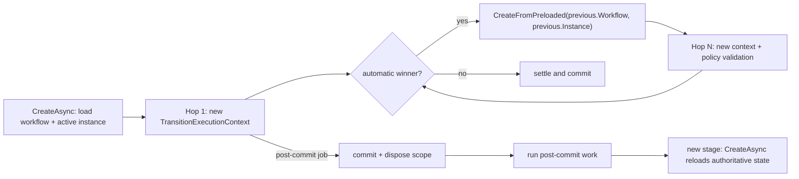

# Inline Auto-Chain Context Reuse

## Purpose

Automatic transition continuations run inline and are awaited. Within one uninterrupted
`TransitionPipeline` invocation, later hops reuse the tracked `Instance` aggregate and the
resolved `Workflow` definition from the previous hop. This avoids reloading the same aggregate
and resolving the same definition for every automatic transition.

This is request-scoped reuse, not a process-wide cache. It ends at a commit/post-commit boundary,
a new dependency-injection scope, a retry, or a subflow callback.

## Execution Model



The first hop uses `TransitionContextFactory.CreateAsync`, which resolves the workflow and calls
`IInstanceRepository.GetActiveAsync`. Each later hop in the same pipeline loop uses
`CreateFromPreloaded(nextInput, previous.Workflow, previous.Instance)`.

`CreateFromPreloaded` does not reuse the previous `TransitionExecutionContext`. It creates a new
one and resolves the current state and next transition against the carried aggregate and workflow.
The next hop then runs policy validation and profile resolution normally.

## What Is Reused

| Value | Behavior |
| --- | --- |
| `Instance` | Same tracked aggregate reference. State, status, stage, tags, active correlations and in-memory latest data mutations remain visible. |
| `Workflow` | Same immutable, version-specific definition reference. States and transitions are resolved again from it. |

The continuation input carries identity and execution data: domain, workflow coordinates,
transition key, chain/correlation identity, headers, route values, termination context and
reservation/ownership flags. `Mode` becomes `Sync`, `TriggerType` becomes `Automatic`, and the
chain depth increases.

## What Is Rebuilt

Every hop receives a new `TransitionExecutionContext`. The previous hop's `Directives`, `Items`,
`Cache`, target state and client response do not leak into it. This is required because directives
represent consumable work such as the next transition or a post-commit job, and script contexts
are disposed during finalization.

The following work still runs for every hop:

- current-state and transition resolution;
- transition policy validation;
- execution-profile resolution;
- the profile's pipeline steps;
- required data writes, transition-record writes and concurrency checks.

## Reuse Boundary

Reuse is valid only while execution remains in the same pipeline invocation and UoW/DbContext.
The runtime must perform a fresh authoritative load after:

- a post-commit barrier and its new runner stage;
- subflow start/forward work that can mutate the parent from another scope;
- subflow completion, fault or cancellation callbacks;
- retry/recovery entry;
- rollback or concurrency-conflict recovery;
- any set-based/direct SQL update that did not update the tracked aggregate.

`TransitionRunner` enforces the main boundary: it commits and disposes a stage before executing
post-commit work. If the parent continues afterward, the next stage enters a new scope and uses
`CreateAsync`; it never carries the old tracked entity across DbContexts.

## Data Consistency

`InstanceDataWriteService.PersistAsync` calls `Instance.AcceptPersistedData`, so data written by
one hop is reflected in the aggregate used by the next hop. The write path's row lock, latest-head
read and version-number reads remain intact. Context reuse removes aggregate rehydration; it does
not weaken instance-data concurrency rules.

Before building a later hop, the pipeline also preserves the active-instance terminal guard and
cancellation check that the storage-backed path used to provide.

## Verified Call Reduction

`TransitionContextFactoryTests.InlineChain_ShouldReduceRepositoryLoadsAndKeepHopContextsIsolated`
compares the old storage-backed shape with the preloaded shape using the real factory and mocked
repository/cache boundaries:

| Chain length | Previous instance loads | Reused instance loads | Previous workflow resolutions | Reused workflow resolutions |
| ---: | ---: | ---: | ---: | ---: |
| 5 hops | 5 | 1 | 5 | 1 |
| 10 hops | 10 | 1 | 10 | 1 |

These are factory dependency-call counts, not total SQL command counts. One aggregate load may
produce multiple SQL commands, and pipeline reads/writes outside context construction remain.
Production SQL counts and end-to-end p50/p95 latency should be measured separately.

## Observability and Verification

`Transition.LoadContext` is tagged with `vnext.context.source=storage` for the first/fresh load and
`vnext.context.source=preloaded` for a reused hop. There is no dedicated context metric meter.

Run the focused tests with:

```sh
dotnet test test/BBT.Workflow.Application.Tests --no-restore \
  --filter 'FullyQualifiedName~TransitionPipelineTests|FullyQualifiedName~TransitionContextFactoryTests|FullyQualifiedName~PostCommitTransitionCoordinatorTests|FullyQualifiedName~TransitionRunnerPostCommitTests'
```

## Change Safety

- Do not carry an EF-tracked `Instance` into a new scope or UoW.
- Do not reuse the complete previous `TransitionExecutionContext`.
- Keep state/transition resolution and policy validation per hop.
- If a new post-commit handler can mutate the parent, make it an explicit reuse boundary.
- If a write path bypasses the aggregate, reload or update the aggregate before the next hop.

## References

- `src/BBT.Workflow.Application/Execution/Transitions/Pipeline/TransitionPipeline.cs`
- `src/BBT.Workflow.Application/Execution/Transitions/Factory/TransitionContextFactory.cs`
- `src/BBT.Workflow.Application/Execution/Transitions/Continuations/InlineContinuationStrategy.cs`
- `src/BBT.Workflow.Application/Execution/Services/TransitionRunner.cs`
- `src/BBT.Workflow.Infrastructure/Data/InstanceDataWriteService.cs`
