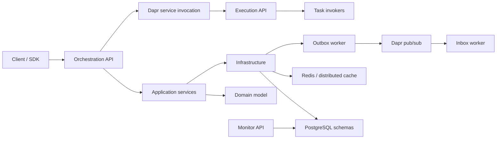

# System Overview

## Purpose

vNext is a distributed workflow orchestration runtime. It separates public workflow
coordination from stateless task execution so that workflow state, domain rules, and
external side effects do not collapse into one service boundary.

## Boundaries

| Boundary | Project | Responsibility |
| --- | --- | --- |
| Orchestration host | `orchestration/BBT.Workflow.Orchestration.HttpApi.Host` | Public workflow API, definitions, instances, transitions, functions, subflow coordination. |
| Execution host | `execution/BBT.Workflow.Execution.HttpApi.Host` | Stateless task invocation endpoint used by Orchestration through Dapr service invocation. |
| Monitor host | `monitoring/BBT.Workflow.Monitor.HttpApi.Host` | Read-only operational endpoints for dashboards and support tools. |
| Domain | `src/BBT.Workflow.Domain` | Aggregates, value objects, domain events, validation contracts, workflow definitions. |
| Application | `src/BBT.Workflow.Application` | Use cases, DTOs, transition pipeline, task executors, query services. |
| Infrastructure | `src/BBT.Workflow.Infrastructure` | EF Core repositories, Dapr integration, routing gateways and remote app services. |
| Workers | `workers/` | Inbox, Outbox, and schema migration workloads. |

## Architecture Flow

Orchestration owns instance state. Execution receives a typed task envelope, performs
the external operation, and returns a task invocation result. Workers process distributed
events outside the request path.

## Contracts

| Contract | Owner | Notes |
| --- | --- | --- |
| Instance APIs | Orchestration | Start, transition, retry, complete, query, functions. |
| Task envelope | Execution abstractions | Carries task type, version, task key, binding, and trace context. |
| Domain events | Events contracts | Published through outbox and consumed by inbox handlers. |
| Schema context | Infrastructure | Repository work must run under the resolved tenant/flow schema. |

## Failure Modes

- Orchestration lock conflict returns a domain error and does not run the transition.
- Pipeline failure marks the instance Faulted when the error is unhandled.
- Execution task invocation failure is returned to the task executor and may be mapped by an error boundary.
- Inbox/Outbox failures are retried outside the request transaction.
- Remote gateway discovery failure returns a stable domain error rather than falling through silently.

## Observability

The runtime enriches logs and traces with domain, flow, flow version, instance id,
instance key, transition key, trigger type, chain depth, and pipeline profile. Runtime metrics are
registered through `WorkflowMetrics` and exported by the shared OpenTelemetry configuration.

## Change Safety

- Do not move state persistence into Execution.
- Do not make pipeline steps load EF includes ad hoc; load shape belongs to repositories.
- New distributed domain events need an event contract, an Inbox handler and structured
  `WorkflowLogs` entries. Subflow terminal events additionally use the post-commit terminal relay;
  see [Event Publish Modes](../runtime/event-publish-modes.md).
- New cross-service calls should preserve correlation, causation, and current-user headers.

## References

- `src/BBT.Workflow.Application/Execution/Transitions/Pipeline/TransitionPipeline.cs`
- `execution/BBT.Workflow.Execution.HttpApi.Host/Controllers/Executions/ExecutionController.cs`
- `src/BBT.Workflow.Execution.Abstractions/TaskEnvelope.cs`
- `src/BBT.Workflow.Infrastructure/Microsoft/Extensions/DependencyInjection/GatewayServiceCollectionExtensions.cs`
- `workers/BBT.Workflow.Workers.Inbox/Handlers/Instances/`
- `src/BBT.Workflow.Events.Contracts/`
- `workers/BBT.Workflow.Workers.Inbox/Handlers/`
