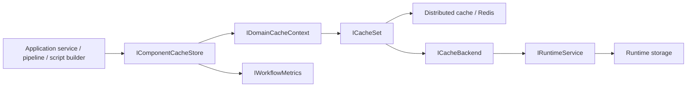

# Domain Cache Context

## Purpose

`DomainCacheContext` is the typed cache boundary for workflow definition components. It
keeps workflow, task, schema, function, view, and extension definitions available through
Redis-first cache sets while preserving a database fallback through runtime backends.

The intent is fast, cluster-wide definition reads. Correctness lives in the shared (L2)
distributed cache and its generation-token key scheme; an in-process (L1) envelope cache
sits in front of it purely to remove Dapr/Redis round-trips, and inherits the same
invalidation because it uses the same keys.

## Boundaries

| Component | Responsibility |
| --- | --- |
| `IDomainCacheContext` | Exposes typed cache sets for supported definition entities. |
| `DomainCacheContext` | Creates the six typed `CacheSet<T>` instances and resolves `Set<T>()`. |
| `ICacheSet<T>` | Provides version-aware get, set, and invalidate operations. |
| `CacheSet<T>` | Implements Redis-first reads, cache population, key strategy, and DB fallback. |
| `IComponentL1Cache` / `ComponentL1Cache` | In-process bytes-mode envelope cache in front of the distributed store; keyed by the L2 keys. |
| `IComponentGenerationProvider` | Redis-backed per-component generation token; a publish bump invalidates every cached version resolution at once. |
| `ICacheBackend<T>` | Loads definitions from runtime storage when Redis misses. |
| `RuntimeCacheBackend<T>` | Bridges cache misses to `IRuntimeService`. |
| `IComponentCacheStore` | Higher-level component lookup API used by application/domain services. |
| `MetricsAwareComponentCacheStore` | Decorates component lookups with hit/miss and size metrics. |

`DomainCacheContext` is not an EF context and does not select PostgreSQL schemas. Schema
selection remains the responsibility of `ICurrentSchema` and runtime/repository code.

## Architecture Flow

Read path:

1. Caller asks `IComponentCacheStore` for a workflow, task, schema, function, view, or extension.
2. Store delegates to the matching typed set on `IDomainCacheContext`.
3. `CacheSet<T>` classifies the request: a full version reads the immutable body key directly;
   any range request (`latest`, `1`, `1.2`) first fetches the component's generation token and
   builds a generation-scoped resolution key.
4. The in-process L1 cache is checked for that key; a hit returns without touching Dapr/Redis.
   For resolution keys the answer is exactly as fresh as L2 because the generation token — read
   from L2 on every call — is part of the key.
5. On L1 miss, Redis is checked; on Redis miss, the backend loads all published versions and
   resolves the best match (concurrent misses for the same key share one load).
6. Loaded definitions are written back to Redis and L1 for future reads.

Write path:

1. Definition publishing/cast handlers call `SetAsync`.
2. `CacheSet<T>` writes the immutable full-version body, bumps the component's generation token
   (making every cached resolution unreachable cluster-wide), and re-warms the common request
   spellings under the new generation.
3. Other pods can read the new definition from the shared distributed cache immediately; their
   L1 entries under the old generation stop being reachable the moment they fetch the new token.

## Contracts

| Entity type | Cache set |
| --- | --- |
| `Workflow` | `Workflows` |
| `WorkflowTask` | `Tasks` |
| `SchemaDefinition` | `Schemas` |
| `Function` | `Functions` |
| `View` | `Views` |
| `Extension` | `Extensions` |
| `Mapping` | `Mappings` |

Key strategy:

| Key | Shape | Notes |
| --- | --- | --- |
| Full | `{component}:{domain}:{key}:full:{canonicalFullVersion}` | Immutable body; TTL is a memory bound only. |
| Resolution | `{component}:{domain}:{key}:res:{generation}:{spelling}` | Answer to a version request (`latest`, `1`, `1.2`); invalidated wholesale by a generation bump. |
| Generation | `{component}:{domain}:{key}:gen` | Small token; bumped on publish/invalidate. |

The L1 cache stores serialized envelopes under these same keys (`ComponentCache:L1Enabled`,
default on; `ComponentCache:L1SizeLimitMb`, default 64). Bytes are deserialized per read, so
every hit returns a fresh instance, and negative answers are never stored in L1.

The one remaining per-resolution round trip — the generation-token read — can additionally be
memoized in process (`ComponentCache:GenerationMemoSeconds`, default 0 = off) at the cost of a
≤N-second cross-pod publish-visibility window; enabling it is a CI/CD contract change, see
[Component Cache Generation Memo](../runtime/component-cache-generation-memo.md).

Version resolution:

- Null, empty, or `latest` resolves to the latest definition.
- Full versions resolve exact package/build versions.
- Artifact versions resolve the best matching full version for that artifact.

## Failure Modes

- Unsupported entity types passed to `Set<T>()` throw `NotSupportedException`.
- Redis read/write errors are logged and traced; reads can still fall back to backend.
- Backend not-found results return cache not-found errors.
- Infrastructure failures from runtime backend are allowed to bubble up.
- Cache writes return success after logging write errors, so callers should not treat cache
  population as the source of truth.

## Observability

`CacheActivityHelper` creates `BBT.Workflow.Cache` activities for get, set, remove,
warmup, and generation operations. Activities include cache key, component type,
cache store, hit/miss, `cache.l1.hit` (whether the in-process layer answered),
generation token, coalescing, item count, and error status. The metrics-aware store records
cache hit/miss counts and approximate cache size/entry gauges by component type.

## Change Safety

- Add a new definition component by extending `IDomainCacheContext`, `DomainCacheContext`,
  DI backend registration, component cast handlers, validators, and `IComponentCacheStore`.
- Keep cache keys stable; changing key shape invalidates existing Redis entries and breaks the
  L1 layer's freshness argument, which depends on resolution keys embedding the generation.
- Per-pod in-memory state is allowed only behind `IComponentL1Cache`, where invalidation is
  carried by the key scheme. Do not add other in-memory definition state.
- Keep cache miss fallback read-only. Publishing remains the write path that populates cache.
- Do not use `DomainCacheContext` for instance data; instance state belongs to repositories
  and `InstanceData` versioning.

## References

- `src/BBT.Workflow.Application/Caching/DomainCacheContext.cs`
- `src/BBT.Workflow.Application/Caching/IDomainCacheContext.cs`
- `src/BBT.Workflow.Application/Caching/CacheSet.cs`
- `src/BBT.Workflow.Application/Caching/ICacheSet.cs`
- `src/BBT.Workflow.Application/Caching/ComponentL1Cache.cs`
- `src/BBT.Workflow.Application/Caching/ComponentGenerationProvider.cs`
- `src/BBT.Workflow.Application/Caching/ComponentCacheOptions.cs`
- `src/BBT.Workflow.Application/Caching/RuntimeCacheBackend.cs`
- `src/BBT.Workflow.Application/Caching/ComponentCacheStore.cs`
- `src/BBT.Workflow.Application/Caching/MetricsAwareComponentCacheStore.cs`
- `src/BBT.Workflow.Application/Microsoft/Extensions/DependencyInjection/WorkflowApplicationModuleServiceCollectionExtensions.cs`
