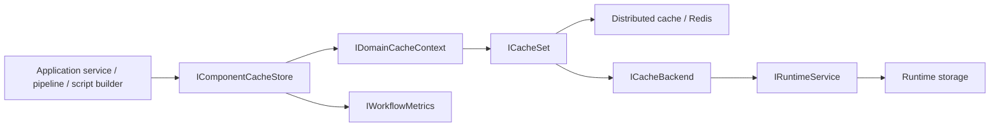

# Domain Cache Context

## Purpose

`DomainCacheContext` is the typed cache boundary for workflow definition components. It
keeps workflow, task, schema, function, view, and extension definitions available through
Redis-first cache sets while preserving a database fallback through runtime backends.

The intent is fast, cluster-wide definition reads without placing an in-memory snapshot
inside each pod.

## Boundaries

| Component | Responsibility |
| --- | --- |
| `IDomainCacheContext` | Exposes typed cache sets for supported definition entities. |
| `DomainCacheContext` | Creates the six typed `CacheSet<T>` instances and resolves `Set<T>()`. |
| `ICacheSet<T>` | Provides version-aware get, set, and invalidate operations. |
| `CacheSet<T>` | Implements Redis-first reads, cache population, key strategy, and DB fallback. |
| `ICacheBackend<T>` | Loads definitions from runtime storage when Redis misses. |
| `RuntimeCacheBackend<T>` | Bridges cache misses to `IRuntimeService`. |
| `IComponentCacheStore` | Higher-level component lookup API used by application/domain services. |
| `MetricsAwareComponentCacheStore` | Decorates component lookups with hit/miss and size metrics. |

`DomainCacheContext` is not an EF context and does not select PostgreSQL schemas. Schema
selection remains the responsibility of `ICurrentSchema` and runtime/repository code.

## Architecture Flow

Read path:

1. Caller asks `IComponentCacheStore` for a workflow, task, schema, function, view, or extension.
2. Store delegates to the matching typed set on `IDomainCacheContext`.
3. `CacheSet<T>` selects latest, full-version, or artifact-version lookup.
4. Redis is checked first.
5. On miss, backend loads from runtime storage.
6. Loaded definitions are written back to Redis for future reads.

Write path:

1. Definition publishing/cast handlers call `SetAsync`.
2. `CacheSet<T>` writes a full-version key, latest key, and artifact-version key.
3. Other pods can read the new definition from the shared distributed cache.

## Contracts

| Entity type | Cache set |
| --- | --- |
| `Workflow` | `Workflows` |
| `WorkflowTask` | `Tasks` |
| `SchemaDefinition` | `Schemas` |
| `Function` | `Functions` |
| `View` | `Views` |
| `Extension` | `Extensions` |

Key strategy:

| Key | Shape | Notes |
| --- | --- | --- |
| Latest | `{component}:{domain}:{key}:latest` | No TTL; overwritten on publish. |
| Artifact | `{component}:{domain}:{key}:artifact:{artifactVersion}` | No TTL; maps artifact version to best package version. |
| Full | `{component}:{domain}:{key}:full:{fullVersion}` | Short TTL; used for exact full-version reads. |

Version resolution:

- Null, empty, or `latest` resolves to the latest definition.
- Full versions resolve exact package/build versions.
- Artifact versions resolve the best matching full version for that artifact.

## Failure Modes

- Unsupported entity types passed to `Set<T>()` throw `NotSupportedException`.
- Redis read/write errors are logged and traced; reads can still fall back to backend.
- Backend not-found results return cache not-found errors.
- Infrastructure failures from runtime backend are allowed to bubble up.
- Cache writes return success after logging write errors, so callers should not treat cache
  population as the source of truth.

## Observability

`CacheActivityHelper` creates `BBT.Workflow.Cache` activities for get, set, remove,
warmup, and version-index operations. Activities include cache key, component type,
cache store, hit/miss, item count, and error status. The metrics-aware store records
cache hit/miss counts and approximate cache size/entry gauges by component type.

## Change Safety

- Add a new definition component by extending `IDomainCacheContext`, `DomainCacheContext`,
  DI backend registration, component cast handlers, validators, and `IComponentCacheStore`.
- Keep cache keys stable; changing key shape invalidates existing Redis entries.
- Do not introduce per-pod in-memory state unless invalidation is designed first.
- Keep cache miss fallback read-only. Publishing remains the write path that populates cache.
- Do not use `DomainCacheContext` for instance data; instance state belongs to repositories
  and `InstanceData` versioning.

## References

- `src/BBT.Workflow.Application/Caching/DomainCacheContext.cs`
- `src/BBT.Workflow.Application/Caching/IDomainCacheContext.cs`
- `src/BBT.Workflow.Application/Caching/CacheSet.cs`
- `src/BBT.Workflow.Application/Caching/ICacheSet.cs`
- `src/BBT.Workflow.Application/Caching/RuntimeCacheBackend.cs`
- `src/BBT.Workflow.Application/Caching/ComponentCacheStore.cs`
- `src/BBT.Workflow.Application/Caching/MetricsAwareComponentCacheStore.cs`
- `src/BBT.Workflow.Application/Microsoft/Extensions/DependencyInjection/WorkflowApplicationModuleServiceCollectionExtensions.cs`
