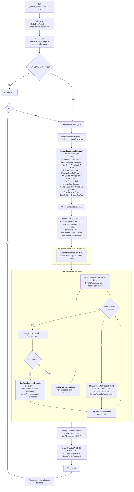
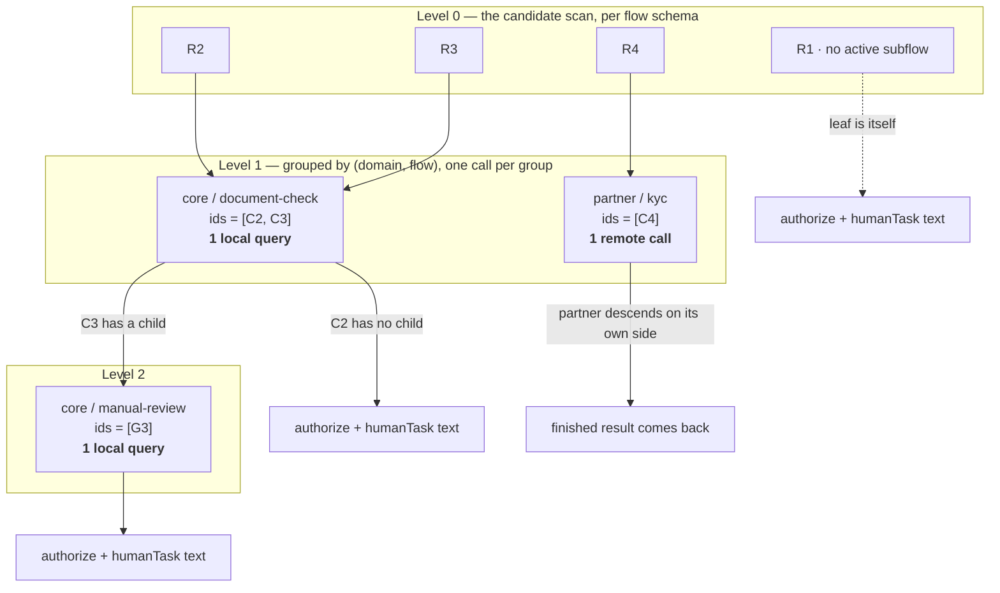
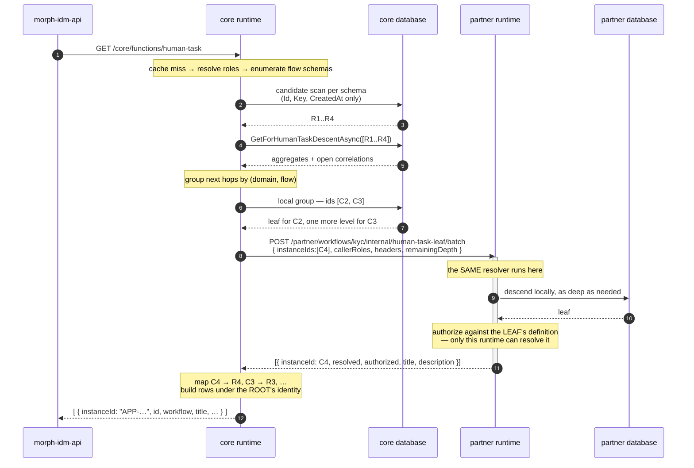
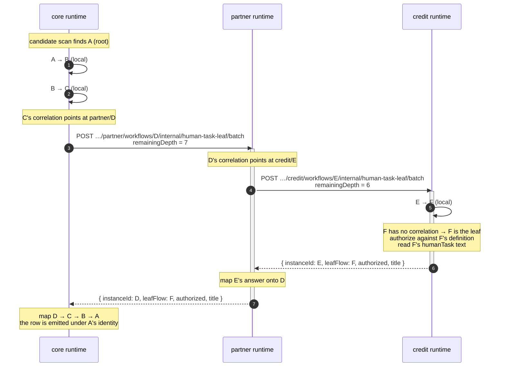

# Human Task Function

`GET /api/v1/{domain}/functions/human-task` answers one question: **which human tasks is this caller
expected to act on?** It is a domain-level function (`HumanTaskFunctionHandler`), not an
instance-level one, and its consumer is morph-idm-api, which reads the discovery `domain-list`
function, calls this route once per registered domain and merges the answers for a client.

> The consumer half is already built: `DiscoveryApplicationService.GetHumanTasksAsync` +
> `VnextHttpClient.GetHumanTasksAsync` in morph-idm-api. Nothing on the vNext side drives the
> cross-domain fan-out.

## How one request is answered



### Why the scan is one statement and the descent is the fan-out

Every flow of a domain lives in a schema of the **same database**, so the per-flow scans differed
only in the name in the `FROM` clause. Running them as parallel branches bought a pooled connection
each to do one sub-millisecond index-only scan — and because each branch needs its own unit of work
(the DbContext is keyed by `(unit of work, schema)`), `FanoutParallelism` became this endpoint's
ceiling on connections, **paid on every request regardless of how much work there was**.

Concurrency multiplied it, and there is no single-flight to fall back on: the response cache is
keyed per caller, so N distinct callers are N independent rebuilds by construction. Measured on a
45-flow domain against PostgreSQL's default `max_connections = 100`:

| Concurrent distinct callers | Before | After |
|---:|---|---|
| 10 | all 200 | all 200 |
| 20 | **13 of 20 → 500** (`53300 sorry, too many clients already`) | all 200 |
| 40 | **16 of 40 → 500** | all 200, peak 51 connections |
| 80 | — | all 200, peak 54 connections |

The work is not serialised by this, it **moves**: the database evaluates the `UNION ALL` arms
itself. `EXPLAIN (ANALYZE)` over all 44 arms of the lab domain reports an `Index Only Scan using
IX_Instances_HumanTaskV2` with `Heap Fetches: 0` for every arm that has rows worth indexing (the
handful of single-page tables correctly choose a seq scan), **execution 0.92 ms** for the whole
statement against 26 ms of planning — one round trip instead of 44.

The descent keeps the fan-out, because that is the phase that needs it: it walks into *other* flows
and other domains, loads aggregates with includes, and two branches can land on the same flow, which
is exactly what a per-schema DbContext key cannot keep apart. It is also far narrower — a domain
publishes many flows and only a few hold human tasks at any moment, so the branch count is now
"flows with work", not "flows that exist". `MaxConcurrentDescents` caps their product across
requests; it sits above `FanoutParallelism`, so a single request is never throttled.

Deliberately **not** a connection-string `Maximum Pool Size`: that caps the pool for every caller of
the database, the write path included, to fix one read endpoint's appetite.

Four things the picture is meant to make obvious:

- the **row is the root and the text is the leaf** — the client knows only the root, and the work
  may be six levels and two domains away from it;
- a **domain boundary is one call for a whole branch**, because the far side runs the same resolver
  and answers with a finished result rather than handing back another level to walk;
- the **cache sits in front of everything**, so a hit answers without touching a database
  (4–9 ms measured, against 40–63 ms for a full rebuild);
- every branch has **its own unit of work**, which is what makes the parallelism safe — a DbContext
  belongs to the unit of work, not to the DI scope.

## Selection: the root row, chosen by the instance's own columns

```sql
-- one arm per flow, all of them in ONE statement on ONE connection
(SELECT '<flow_key>' AS "Flow", "Id", "Key", "Type", "CreatedAt"
   FROM "<flow_schema>"."Instances"
  WHERE "Type" IN ('R', 'P')
    AND "Status" IN ('A', 'B')
    AND "EffectiveStatus" = 'A'
    AND "EffectiveStateSubType" = 6
  ORDER BY "CreatedAt" DESC
  LIMIT <HumanTaskFunction:PerSchemaLimit>)
UNION ALL
(...)   -- batched at HumanTaskFunction:FlowsPerScanStatement arms per statement
```

Each arm is a parenthesised subquery, so the `ORDER BY … LIMIT` binds per flow exactly as the
per-flow form did, and each arm is planned independently — which is what keeps every one of them on
the partial index.

**No existence check precedes it.** "This flow is published" and "its schema is migrated" are the
same fact, kept so from both directions: `DefinitionAppService.PublishAsync` migrates the new flow's
schema *before* it writes the definition instance and returns on failure, and DbMigrator's
`SchemaMigrationRunner` discovers domain schemas *from* `sys-flows` and migrates every one — which is
also what brings an existing schema up to a newer migration set. Every flow therefore has the same
table shape, and the flow list comes from that very table, so probing `pg_class` would spend a round
trip per cache miss re-deriving a guarantee two writers already keep. If something outside the
runtime broke the invariant the statement fails and the request answers 500, which is what the
per-flow form did too — its query was not isolated either. The flow key rides back as a literal column because after the union the rows are
otherwise indistinguishable and the descent has to re-enter each candidate's own flow. Both the key
and the schema name are validated identifiers; nothing in this statement comes from a request.

The scan selects **a narrow projection, not the aggregate**: `Flow`, `Id`, `Key`, `Type`,
`CreatedAt` — identity and the sort key. Everything the response says about a task comes from the leaf, which the descent loads
separately, so hydrating `DataList` and the correlations here would be work thrown away for every
candidate. It also decides the plan: under `SELECT *` a covering index payload can never be reached,
which is why the old `IX_Instances_HumanTask` carried six `INCLUDE` columns that never paid for
themselves. With the projection, `IX_Instances_HumanTaskV2` covers the whole scan — `Id` and
`CreatedAt` are its key, `Key` its only `INCLUDE`.

The predicate text lives in exactly one place — `HumanTaskQuerySql.Predicate` — and is shared by the
query, the EF partial-index filter and the migration that creates it. **This is not a style
preference.** PostgreSQL discharges partial-index applicability by proving implication over the
predicate's parse tree and cannot match a re-spelling, so a stray space or a reordered conjunct
silently costs the index and turns the fan-out into a sequential scan per flow schema, on the warm
path, with no error anywhere. Sharing the constant makes that divergence unrepresentable.

Every term is a literal for the same reason plus one more: with parameters the implication is only
provable under a custom plan, so any environment setting Npgsql's `Max Auto Prepare > 0` would lose
the index in production only. There is no injection surface — no value comes from a request.

### Why each term

| Term | Why |
|---|---|
| `Type IN ('R','P')` | Replaces an existence probe that cast the `text` `ExtraProperties` column to `jsonb` on every row of every write. `'P'` is included because a **SubProcess is fire-and-forget** — nothing projects its state onto an ancestor, so it is its own unit of work and its human states used to be invisible entirely. `'S'` stays excluded: its state is projected onto the root that represents it, and listing both would duplicate one task. |
| `Status IN ('A','B') AND EffectiveStatus = 'A'` | The SQL spelling of the served `Instance.GetEffectiveStatus` clamp. **The `Status` term is not redundant** — see below. |
| `EffectiveStateSubType = 6` | `StateSubType.Human`, projected up the ancestor chain by `PropagateEffectiveStateToParent`. |

### `EffectiveStatus` alone is not the clamp

`Complete`, `Cancel` and `Fault` all call `ResyncEffectiveStatus()`, and that method is a **no-op
while a SubFlow correlation is open** (`Instance.cs`) — while the cancel/fault cascade closes those
correlations *afterwards*. So a level cancelled mid-subflow kept a live child's `'A'` in the raw
column, and the served value only looked right because `GetEffectiveStatus` clamps
`Status.IsTerminal || EffectiveStatus.IsTerminal ? Status : EffectiveStatus`.

`Complete` and `Cancel` now repair the raw column at the source (`ForceEffectiveFromOwnTerminalState`).
`Fault` deliberately does **not**: `Unfault` brings a faulted level back to Active while its child may
still be running, and nothing could restore the child's projection afterwards — a correlation carries
a state key and a terminal outcome, never a live status.

So the `Status` term stays: rows written before the repair keep the old shape, faulted levels are
never repaired, and it costs nothing. Without it the list would offer cancelled and faulted cases,
carrying their customer-identifying `humanTask` text, as open tasks.

### The `Effective*` invariant

`Effective* = HasActiveSubFlow ? (leaf projection) : (the instance's own Current*/Status)`

`EffectiveStateSubType` had **no reset writer at all** before this: the SubFlow terminal paths reset
the state key and the status and left the type/sub-type pair behind, and the resume re-enters the
pipeline at `ClearBusyOnResumeStep` (79), past `ChangeStateStep` (50) — so the resume hop itself
never rewrites it, and a parent parked in a SubFlow state waiting for a human or an event never
reaches another `ChangeState`. A finished child's `Human` sub type therefore stuck to its parent
permanently, and that parent was listed as an open human task, for every caller.

`Instance.ResyncEffectiveStateFromCurrent()` moves the whole trio and carries the same
`!HasActiveSubFlow` guard `ResyncEffectiveStatus` has — the state half was missing it, so with two
open correlations one completing pulled the state back to the parent's own while the status still
described the surviving child.

The column also feeds `metadata.effectiveState*` on the instance GET and list view, and the script
rule context (`ExpressoRuleContextMapper`), so the fix matters beyond this function.

## Reaching the leaf

The candidate row is the **root** — that is the identity the client holds and the only one it can
address. The work may be several SubFlow levels down and in another domain, so the authorization
decision and the `humanTask` text come from the **leaf**. `IHumanTaskLeafResolver` walks it.

- **Batched by level, not by instance.** Every candidate's next hop is grouped by
  `(SubFlowDomain, SubFlowName)` and resolved in one call per group.
- **A cross-domain group hands the rest of the descent to the domain that owns it**
  (`POST …/internal/human-task-leaf/batch`), which recurses locally and answers with a finished
  result. Cost is **one remote call per domain boundary**, not one per instance per level.
- **Bounded** by `HumanTaskFunction:MaxDescentDepth` plus the batch cap on the endpoint. Exceeding
  the bound reports the instance as *unresolved*, never as "nothing to do".
- **Identity never travels down.** Each level maps its children's answers back onto its own ids.

### The gate is the leaf state's `queryRoles`

The list answers **"which human tasks am I responsible for?"** — a *visibility* question. Which button
a caller is offered is settled later, when the client opens the instance and the state function runs.
So the decision is the leaf state's `queryRoles`, resolved in this order:

1. the parent's **stamped state override** (`subflow.state_role_overrides`),
2. the leaf **state's** own `queryRoles`,
3. the leaf **workflow's** root `queryRoles`.

That is the same resolution `TransitionAuthorizationManager.IsQueryAllowedAsync` performs for the
state, data, view, schema and incident reads — so the list and the screen it leads to now answer to
one gate.

**It used to authorize transitions**: an OR over everything `GetAvailableUserTransitionKeys` returned
for the state. That was wrong three ways, and all three disappear rather than being fixed:

- It made this a **fourth** authorization surface, and one that did not apply the `availableIn`
  per-state role narrowing the state function applies — so the list could be **more permissive** than
  the screen it led to, showing a task, with its `humanTask` text, to a caller who would then be
  offered nothing.
- **`cancel` was a back door by construction.** The well-known `cancel`/`updateData`/`exit` are
  appended from *every* state and an empty grant set allows, so a role-less `cancel` authorized every
  caller for every instance. The scenario fixture had to give `cancel` an explicit role set purely to
  stop its own negative tests being vacuous.
- The rule could not be stated in a sentence a domain team could reason about.

#### An undeclared state is dropped, not published

`IsAnyRoleAllowedForGrantsAsync` **allows on an empty grant set** — that is the right default for the
single-instance reads, where the caller already holds an instance id. It is the wrong default here:
letting it through would publish every human task of every flow that has not authored `queryRoles` to
every caller. Measured on `vnext-example`: **8 of the 10** workflows with a `subType: 6` state declare
none, at the state or at the root.

So this path **fails closed**. A leaf whose state and workflow both declare no `queryRoles` is dropped
with `WorkflowLogs.HumanTaskQueryRolesUndeclared` (20459), which names the instance, flow, state and
domain — loudly enough to drive the migration. A task list is the one read surface where "no rule
authored" must not mean "everyone".

#### The parent's state override finally has a reader

`SubflowStarter` has always stamped **both** override maps onto a child at start —
`subflow.transition_role_overrides` and `subflow.state_role_overrides` — but nothing in `src/` read
the second: a dead write. `AuthorizeAppService` resolves state overrides from the **parent's**
definition, a path that needs an active SubFlow correlation and therefore returns nothing at a leaf.
`SubFlowStateOverrideReader` is that missing mirror. It is consulted from
`TransitionAuthorizationManager.IsQueryAllowedAsync` — the single queryRoles gate behind the state,
data, view, schema and incident functions, behind `authorize`'s query branch and behind this list —
so a parent's narrowing applies wherever the child is reached from rather than only where a surface
remembered to look. That closes a divergence the first version of this change left behind: the
transition override was applied on the state function's subflow bubbling while the state override was
not, so the two halves of one `overrides` block behaved differently on the same surface.

Found while writing it: both readers deserialized with **default** `JsonSerializerOptions`. `RoleGrant`
exposes PascalCase properties, so a case-sensitive read left `Role` null and its
`Check.NotNullOrWhiteSpace` threw — the stamp looked malformed and *every* override silently fell
back. Both now use `JsonSerializerConstants.JsonOptions`.

### A SubProcess is addressed by its own id

The row's `instanceId` is the candidate's business `Key` — except for a SubProcess, where it is the
candidate's **`Id`** (`HumanTaskCandidate.AddressableId`).

A SubProcess is an **independent flow**, not a correlation the parent represents. Nothing projects
its state upward, no ancestor can be clicked to reach it, and the domain that owns it is the domain
that lists it — a SubProcess spawned by a core root and living in `partner` appears in **partner's**
answer, never in core's. It descends into its own SubFlows by the same rules as any root, so its
title and authorization come from *its* leaf, however many levels and boundaries below.

It cannot be addressed by `Key`, because `SubflowStarter` copies the parent's `Key` onto the child.
Following that key leads a client to the **root** — a different instance, in a different domain,
with a different state and a different transition set. `Id` is the only identifier that is the
SubProcess's own, so the scan carries `Type` (covered by the V2 index's `INCLUDE`) purely to make
that choice. The additive `id` field is on every row regardless, so a consumer that dedupes or
follows rows never has to know the rule.


### Parallelism: a DbContext belongs to the unit of work, not to the DI scope

The fan-out runs one branch per workflow schema, and **each branch opens its own unit of work**
(`ExecuteInIsolatedUnitOfWorkAsync`). A fresh DI scope is not enough, and this is the part that is
easy to get wrong:

`AetherDbContextProvider` resolves the context as `(IUnitOfWorkManager.Current, schema)`, and the
ambient unit of work is an `AsyncLocal` that **flows into every branch** of a
`Parallel.ForEachAsync`. Opening a scope isolates the services; it does not isolate the context. So
parallel branches under one request keep sharing a context per schema however many scopes they open.

This path survived that for a long time by accident of addressing: every branch switched to a
*different* flow schema, and the provider's schema key then handed each one its own context. The
leaf descent broke the accident — it walks into OTHER flows, so two branches can land on the same
schema — and the second concurrent query answered with *"A second operation was started on this
context instance"*, surfacing as a 500 on the whole endpoint.

Nested hops inside a branch deliberately **inherit** the branch's unit of work rather than opening
their own. They run sequentially within the branch, so one context per schema is enough, and it
keeps open connections bounded by the fan-out width instead of width × recursion depth.

> Applies to any read-only parallel work in this runtime, not just this endpoint. Reach for
> `ExecuteInIsolatedUnitOfWorkAsync` rather than relying on branches happening to address distinct
> schemas.

### Why the descent takes an id LIST

An instance has **at most one** open blocking correlation, so the list is never "one instance's
several subflows". It is one **level** of the walk: `n` different parents, each contributing at most
one child.



Four roots, depth up to three: **three calls**, not one per instance per level. Per-instance descent
would have made four at level 1 alone, and a separate HTTP round trip for every cross-domain child.

Each level answers about the ids it was given, and the level above **maps those answers back onto
its own ids** — so `G3`'s answer becomes `C3`'s, which becomes `R3`'s. Identity never travels
downward: the row the client sees is always the root.

### What happens when a group is cross-domain

Nothing about the algorithm changes — only who runs it. A group whose `SubFlowDomain` is not this
runtime's is sent, **as one call**, to that domain's identical endpoint, which runs the **same
resolver** and descends the rest of the way on its own side (including hopping again to a third
domain). What comes back is already finished: authorized or not, with the leaf's text.



Two things are load-bearing in that picture:

- **Authorization happens where the leaf lives.** Only the owning runtime can resolve the leaf's
  workflow definition, so the caller's roles and headers travel to it rather than the decision
  travelling back. That is why the request body carries them.
- **A failed hop is an incomplete answer, not an empty one.** One unreachable partner domain must
  not blank a banker's inbox, so only that group's instances are reported as dropped — counted and
  logged — while the rest of the list still answers.

### Worked example: two boundaries, six levels

`A → B → C` in `core`, `D` in `partner`, `E → F` in `credit`. The leaf is **F**. Note who makes the
second crossing: `core` never talks to `credit`.



**Two remote calls for two boundaries** — not one per level, and not one per instance. The depth
budget is spent by the whole chain: it is decremented per hop and carried across the wire, so
crossing a boundary buys no extra budget.

Both facts are pinned by `HumanTaskLeafDescentScenarioTests`, which builds a separate runtime per
domain (its own repository, component cache and resolver) and puts every cross-domain hop through a
real JSON round-trip — so the wire contract is covered by the same tests as the walk.

### Overrides are read from the leaf's own stamped map

`SubFlowOverrideReader.TryRead(instance)` reads `subflow.transition_role_overrides` from the
**child's** `ExtraProperties`, stamped by `SubflowStarter` at start. The parent-side reader
(`state.SubFlow.Overrides.Transitions`) returns null whenever the instance has no active SubFlow
correlation — true of every leaf by definition — so evaluating a leaf through it would find no
overrides, and **a child transition authored with no `roles` of its own, gated solely by its parent's
override, would become visible to every caller**: an empty grant set allows.

The stamped map is a start-time snapshot. Revoking an override never reaches children already in
flight, and children started before the stamping existed carry no map. That is the same semantics
the state function has always had, so reading it here converges the two surfaces rather than
inventing a third.

## Bounds and truncation

`HumanTaskFunction:PerSchemaLimit` (200) is enforced in SQL; `ResultCap` (500) applies after
authorization and ordering. Both bound the **sort and the response, not the scan** — under a
sequential-scan plan the database still reads every row before the limit applies, and the limit must
not be recorded as a fix for scan cost.

Truncation is signalled by the **`X-VNext-HumanTask-Truncated` response header**, not a body field:
the body is a bare JSON array and morph-idm deserializes it as a list, so an envelope would be a
breaking change. A silently capped task list is a wrong answer, not a shorter one.

### `HumanTaskFunction` settings

| Key | Default | What it bounds |
|---|---:|---|
| `PerSchemaLimit` | 200 | Candidate rows per flow, in SQL. Bounds the sort and the response, not the scan. |
| `ResultCap` | 500 | Rows in the merged response, after authorization and ordering. |
| `MaxDescentDepth` | 10 | SubFlow levels one candidate may be walked down before it is reported unresolved. |
| `FlowsPerScanStatement` | 64 | Arms per scan statement. **Round trips, never connections** — the batches share the one connection. Bounds statement size and plan-cache churn on a domain with very many flows. |
| `FanoutParallelism` | 10 | Descent branches **within one request**. No longer touches the scan. |
| `MaxConcurrentDescents` | 32 | Descent branches **across all in-flight requests**. Keep it above `FanoutParallelism` so a lone request is never throttled, and below the connection pool so this read endpoint cannot starve the write path. |

## What the cost is made of

Measured on the four-domain lab, warm, 47 published workflow schemas, one chain six levels deep
across two domain boundaries:

| | Wall clock |
|---|---|
| Cache hit | **3–9 ms** — no database touched |
| Full rebuild (`X-VNext-Cache-Override`) | **40–63 ms** (avg 51) |

The rebuild is one scan statement plus the slowest descent branch. The scan is a single round trip
whose execution is under a millisecond for the whole domain (0.92 ms measured over 44 arms); what it
costs instead is **planning**, roughly linear in the arm count (26 ms for those 44), and that is paid
only on a cache miss.

### How the scan scales with the flow count

Measured on a synthetic database of 400 flow schemas (40 of them holding 150 candidates each, 360
holding none — the distribution the lab shows), over the same docker network the runtime uses, timed
inside one session so container and connection setup are excluded:

| Flows | per-flow, one statement each | one `UNION ALL` | batched at 64 |
|---:|---:|---:|---:|
| 44 | 7.7 ms / 44 stmt | 5.6 ms / 1 | **5.3 ms / 1** |
| 100 | 17.6 ms / 100 stmt | 14.0 ms / 1 | **10.9 ms / 2** |
| 200 | 28.3 ms / 200 stmt | 26.1 ms / 1 | **23.5 ms / 4** |
| 400 | 49.3 ms / 400 stmt | 49.8 ms / 1 | **43.7 ms / 7** |

Two things to read off it. First, **in pure database time the union is only marginally cheaper, and
at 400 arms a single statement is no longer cheaper at all** — which is why
`FlowsPerScanStatement` exists and why 64 is its default. The saving that matters is not here: it is
the 44-to-1 collapse of DI scopes, units of work and pooled connections, which this test excludes by
construction.

Second, **the cost is planning, and planning is amortizable.** At 200 arms, `PREPARE` + repeated
`EXECUTE` measured 28.7 ms for the first execution and **1.4–1.8 ms** for every one after. The
statement text is stable for a domain until a flow is published, so Npgsql's `Max Auto Prepare`
would collect that saving. It is safe here precisely because every term of the predicate is a
**literal**: under `SET plan_cache_mode = force_generic_plan`, all 200 arms still report
`Index Only Scan` with `Heap Fetches: 0` and 2.0 ms of execution. Parameterising the predicate would
break that, which is the warning in `HumanTaskQuerySql`. Enabling auto-preparation is a
connection-string-wide decision affecting every query in the process, so it is recorded here as a
measured option rather than applied.

### What gets bigger at 200 flows

The scan's result set, not its time. `PerSchemaLimit` is per flow, so a 200-flow domain can return
**200 × 200 = 40 000 candidate rows** to be ordered and then cut to `ResultCap`. At the measured
~64 bytes per row that is ~2.5 MB materialised per rebuild. This is not a regression — the per-flow
form collected exactly the same rows into one list — but it arrives as one buffer instead of 200
small ones, and it is the term that grows fastest with flow count. `PerSchemaLimit` is the knob:
`ResultCap` cannot be pushed down into the scan, because authorization runs afterwards and would
then have too few rows to fill the list from.

**`FanoutParallelism` no longer tracks the scan.** It used to: a rebuild opened one branch — and one
pooled connection — per published flow whether or not that flow had any work, which made the width
this endpoint's connection ceiling on every request. It now bounds only the descent, over flows that
actually produced a candidate. `MaxConcurrentDescents` bounds their product across concurrent
requests, which is the number that actually meets the pool. See *Why the scan is one statement and
the descent is the fan-out* above for the measured before/after.

Two things deliberately left alone, recorded so they are not rediscovered as bugs:

- **The evaluator prefetch is per instance, by design.** `CreateEvaluatorAsync` takes one instance,
  and a `$PreviousUser` / `$PreviousBehalfOfUser` grant makes it read that instance's previous manual
  transition. A flow whose human transitions use those grants therefore costs one extra query per
  candidate in its branch. Unmeasured here — the scenario's flows use static grants — and it is the
  most likely next bottleneck if the list ever gets slow.

## Cache

| Key | `HumanTaskFunctionCache` |
|---|---|
| Shape | `human-task:v1:{domain}:{callerScope}:{authHeaderHash}` |
| TTL | `HumanTaskFunctionCache:TtlSeconds` (60) |
| Kill switch | `Enabled = false` |
| Override | `X-VNext-Cache-Override` header, honoured while `AllowClientOverride` is true |

**No validation query.** The state- and data-function caches store one instance's response beside a
fingerprint and re-check it on every hit, so their TTL only bounds what the fingerprint misses. A
list spans every workflow schema and has no single-row fingerprint, so this is a plain TTL cache.
The accepted symptom, stated plainly: *a task completed by colleague B is still offered to colleague
A for up to 60 s, who opens it and gets an error.*

**The key covers every authorization input, deliberately.** `CallerScopeHash` covers role, identity
and culture. It does **not** cover `$.context.Headers.*`, and a dynamic role grant reads a header
name the *workflow author* picked — so the set that matters cannot be enumerated when the key is
built. Every non-volatile header is folded in, erring towards a lower hit rate rather than towards
serving one caller scope's list to another. The volatile denylist (`traceparent`, `x-request-id`,
`user-agent`, …) is the one tuning knob, and widening it is a **security** decision, not a
performance one. The entry holds `humanTask` text, which can be customer-identifying; this is what
makes holding it safe.

**The override skips the read, never the write.** A full bypass would hand an unauthenticated caller
a free way to make this endpoint more expensive than it is with no cache at all — this route has no
rate limiter of its own. The rebuild takes the same single-flight gate (`AcquireBuildGateAsync`) as
an ordinary miss, because a fixed TTL synchronises expiry and without the gate every caller whose
entry expires in the same second starts its own full fan-out.

## Observability

Three spans under the `Instance.Read/humanTasks` envelope, all on the existing
`BBT.Workflow.Instances.Read` source — no new `ActivitySource`, so no host `AdditionalSources` change:

```
Instance.Read/humanTasks
├─ Cache.Get/human-task:v1:…            hit → the tree ends here
├─ HumanTask.Scan/ht-a                  candidates=4        ← one per schema, in parallel
│  └─ Db.SELECT …
├─ HumanTask.Descend/ht-a               roots=4 resolved=4 authorized=3
│  ├─ HumanTask.Authorize/ht-a          leaves=1 authorized=1
│  └─ Subflow.Descend/ht-b              depth=1 transport=local
│     ├─ HumanTask.Authorize/ht-b       leaves=2 authorized=2
│     └─ Subflow.Descend/ht-d           depth=2 transport=remote
│        └─ …partner answers with a finished result
└─ Cache.Set/human-task:v1:…
```

Selection and descent are timed separately because their costs are unrelated: the scan is one query
per schema, the descent is a walk whose width is the candidate count and whose depth is the chain.
`roots − resolved` on the descend span is that branch's silent-drop count. Authorization is one span
per level rather than per leaf — the counts carry the detail, and a per-leaf span would swamp the
trace.

No new metric family. On the existing `Instance.Read/humanTasks` span:
`vnext.humantask.schemas_scanned`, `.candidates`, `.returned`, `.dropped`, `.workflows_dropped`,
`.truncated`; cache hit/miss/bypass through `SetReadOutcome` on the transaction; the descent uses
the existing `Subflow.Descend` span.

**Drops are counted because they are invisible otherwise.** A row dropped for an unresolvable
definition and a row the caller may not act on look identical in the response — both just make the
list shorter. `WorkflowLogs` 20450–20457 name each reason.

## Security posture

This route accepts a **self-asserted caller identity**: there is no `[Authorize]` on
`FunctionController`, identity arrives in unsigned headers, and there is no rate limiter. The
internal `human-task-leaf/batch` endpoint carries the caller's roles across a domain boundary with
no authorization of its own, relying on network isolation — the same posture as the `related-data`
endpoints. **None of this is made worse by the work described here, and none of it is improved by
it.** Nothing on this page may be described as an authorization improvement while that remains true.

## Deployment sequence

The predicate change invalidates the old `IX_Instances_HumanTask`, so this is index **replacement**:

1. **Create** `IX_Instances_HumanTaskV2` (migration `20260917150000_AddHumanTaskOwnColumnsIndex`).
   DbMigrator is a separate job from the hosts, so this cannot be atomic with the code.
2. **Switch** the predicate (code release).
3. **Drop** `IX_Instances_HumanTask` (migration `20260917210000_DropLegacyHumanTaskIndex`).

**Step 3 closes the rollback window, and that is a decision, not an oversight.** While the old index
existed, reverting the predicate still landed on an indexed plan; after the drop a revert falls back
to a sequential scan per flow schema. It was dropped because keeping it is not free: a partial index
evaluates its predicate per tuple on every INSERT and UPDATE, so every write to every flow schema
was paying for a `text→jsonb` cast that no read benefits from — and for six `INCLUDE` columns a
`SELECT *` query could never reach. If steps 2 and 3 ship together, a rollback means re-running the
`Down` of step 3, which rebuilds the index at the usual cost.

`CREATE INDEX CONCURRENTLY` is unavailable (a migration runs in a transaction), so each build takes a
`SHARE` lock and blocks writes to that flow for its duration, once per flow schema, and the
definition-publish path can trigger the chain outside any maintenance window. **Measure the schema
count and per-schema row counts first, and record the concurrent write-blocking width, not only the
total wall clock.** Rollback is not symmetric: reverting step 3 is another N index builds.
