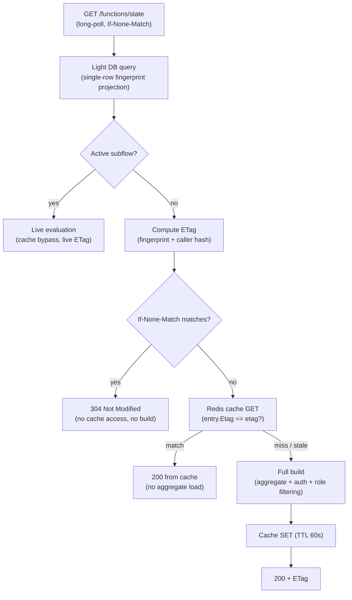

# State and Data Function Cache and Fingerprint ETag

## Purpose

The state function (`GET .../functions/state`, long-polling) is the hottest read path in the
runtime: clients poll it continuously with `If-None-Match` until the instance reaches a terminal
status. Rebuilding the full response on every poll (aggregate load, authorization gate, role
filtering, canonical-JSON hashing) is wasteful because the answer only changes when the
instance's state or status changes.

The runtime therefore derives the ETag from a **state fingerprint** instead of the response
body, and backs it with a distributed response cache. The fingerprint is loaded by a
single-row projection query (the *light DB query*), so the dominant poll cycle is answered
without touching the aggregate, the cache, or the response builder.

## Request flow



Edge cases not shown: when the fingerprint query finds no instance, the full path runs and
produces the proper error (404). When `StateFunctionCache:Enabled` is `false`, the left column
is skipped entirely, but the ETag is still computed with the same formula inside the full
build — toggling the flag never changes ETag semantics.

## The three structures

### Light DB query (fingerprint)

`IInstanceRepository.GetStateFingerprintAsync(identifier)` projects one row — no includes, no
aggregate materialization:

```
SELECT Id, Key, EffectiveState, Status, FlowVersion,
       EXISTS(active SubFlow correlation) AS HasActiveSubFlow
```

- Identifier resolution mirrors `FindByIdentifierAsReadOnlyAsync`: id first, then the most
  recent row by key (`ORDER BY CreatedAt DESC`).
- `HasActiveSubFlow` translates to an `EXISTS` subquery served by the partial index
  `IX_InstancesCorrelations_ActiveBlockingSubFlow` (`ParentInstanceId WHERE IsCompleted = false
  AND SubFlowType = 'S'`) — a single B-tree probe, not a correlation load.
- `EffectiveState` (not `CurrentState`) is used because subflow state changes are propagated
  upward into the parent's `EffectiveState` column.

### ETag

Computed by `IStateFunctionCache.ComputeEtag` — a deterministic SHA-256 hash (32 hex chars):

```
etag = h(instanceId | effectiveState | status | flowVersion | callerHash)
```

- **Deterministic across pods**: any instance of the service computes the same ETag for the
  same fingerprint, so 304 works with an empty cache (after TTL expiry, Redis flush, or
  failover).
- **`callerHash` is inside the hash**: the response is authorization- and localization-scoped,
  so a caller switching role, actor, or culture must never receive a false 304.
- **Subflow variant**: when an active subflow exists, the response content comes from a live
  subflow call, so the displayed state and status are folded into the hash:
  `h(... | displayedState | displayedStatus)`. The parent row alone cannot see
  subflow-internal Busy/Active flips (`PropagateEffectiveStateToParent` updates only
  `EffectiveState`, never `Status`, and is asynchronous via the Inbox worker).
- The ETag intentionally does **not** track instance-data-only changes: the state function
  signals state/status transitions, not data versions. `X-Entity-ETag` served from cache may
  lag data-only updates until the next state/status change (accepted by design — the data
  function is the authority for data freshness).

### Distributed cache

`IStateFunctionCache` over Aether `IDistributedCacheService` (Redis):

```
key   = state-fn:{domain}:{workflow}:{instance}:{callerHash}
value = { Etag, EntityEtag, Output }          # full role-scoped response body
TTL   = StateFunctionCache:TtlSeconds         # default 60s = client long-poll timeout
callerHash = h(role | roles | actor identity | culture | extensions | version)
```

- The cache serves only callers **without** a current ETag (first poll, evicted client state).
  Validation on a hit is a single ETag equality check — state, status, version, and caller
  scope are all inside the hash, so a matching entry is guaranteed fresh.
- Actor identity participates because `$InstanceStarter`/`$PreviousUser` pseudo-roles are
  matched against `ICurrentUser`; culture participates because state alias labels are
  localized.
- Cache failures never fail a request: read errors degrade to a miss, write errors are
  swallowed (`StateFunctionCacheError`, EventId 20404).
- The authorization gate (`IsInstanceQueryAllowedAsync`) is skipped on a validated hit by
  design: the key pins the caller, the fingerprint pins the instance facts the gate depends on.

## Subflow behavior

Instances with an open SubFlow correlation bypass both the 304 fast path and the cache — the
response is composed from a live call to the subflow's own state function
(`IInstanceQueryGateway`, in-process for same-domain, HTTP/Dapr for cross-domain). That call
benefits from the *subflow side's* own fingerprint cache: the subflow service answers it from
its Redis entry or fingerprint fast path like any other state request. Nothing is ever written
to the parent's cache while the correlation is open.

**The subflow call always returns a body — a 304 from the subflow is impossible by contract.**
The parent needs the subflow response to compose its own; it never sends `If-None-Match`
downstream. The in-process gateway maps only the typed `input.IfNoneMatch` (never set for this
call), and the remote path (`RemoteInstanceQueryAppService.GetFunctionWithStateAsync`)
explicitly strips `If-None-Match` from the forwarded caller headers — the caller's ETag belongs
to a different resource (the parent), and a false 304 would leave the composer with no body.

## Data function

The data function (`GET .../instances/{instance}/data` and `functions/data`) uses the same
mechanism with a data-centric material — the design principle is that the data function
signals **data change points**, not state or extension flux:

```
etag = h(instanceId | latestDataEtag | flowVersion | callerHash)
key  = data-fn:{domain}:{workflow}:{instance}:{callerHash}
callerHash = h(roles | actor identity | culture | version)   # extensions deliberately EXCLUDED
```

- **Change signal is `InstanceData.ETag`** of the IsLatest row — a fresh ULID on every
  latest-line data write. It is read index-only via `UX_InstancesData_Instance_IsLatest`
  (ETag is in the INCLUDE list) by `IInstanceRepository.GetDataFingerprintAsync`.
- **`flowVersion` is in the material** because a flow migration can change `x-roles` field
  filtering and extension definitions without a data write.
- **Extensions are outside the key and the ETag.** The ETag signals the data change point
  only; requests differing only in the requested extension list share one key and one ETag.
- **Latest-data requests only.** Pinned-version requests (`?version=X`) bypass the fast path
  and the cache: a write into an *older* version line (`AddDataWithVersion`) creates a new row
  without touching the IsLatest row's ETag, so the latest-based material cannot see it. On the
  full path, pinned requests hash the **resolved** row's ETag instead — correct, because a
  write into that line produces a new row with a new ULID.
- **No subflow bypass**: the data body is always the parent's own `FindData` result; an active
  subflow only contributes extension output — which is never cached (below).
- A 304 answered from the fingerprint skips the aggregate load, the authorization gate, field
  filtering **and the extension run** — including always-on Global extensions, which are the
  most expensive part of a data read.

**The cache stores pure instance data — extension output is never cached:**

- An entry holds only the caller-scoped, field-filtered `Data` payload.
- A validated entry does **not** short-circuit the request: it feeds the **data portion** of
  the build (skipping the x-roles field filtering step — which may evaluate dynamic role
  scripts) while the extension pipeline **always runs fresh** against the raw instance data.
  This holds for every 200: whether or not the caller requested extensions, data comes from
  the cache when valid and extension output is never stale.
- Every latest-data 200 with a resolved data row warms the cache (data-only entry), including
  responses that carried extension output.
- Responses with no resolved data row are never cached.
- The heavy wins remain on the 304 fast path (no aggregate, no auth, no filtering, no
  extension run — including always-on Global extensions); the body cache additionally removes
  the field-filtering cost from every 200.

Accepted staleness (by design — "the critical thing is the data change point"): the ETag does
not track extension output, so an ETag-holding client receives 304 until the next data write
or flow migration even if extension output changed in the meantime; clients that need fresh
extension output call without `If-None-Match` and always get a freshly computed response.
Similarly, state-dependent `queryRoles` outcomes are only re-evaluated when data or flow
version changes (transitions usually write data, which re-triggers everything).

## Configuration

```json
"StateFunctionCache": {
  "Enabled": true,
  "TtlSeconds": 60
},
"InstanceFunctionCache": {
  "Enabled": true,
  "DefaultTtlSeconds": 60
}
```

Orchestration host `appsettings.json`. `Enabled=false` is the kill switch (full evaluation on
every request); TTL bounds only the residual staleness of parts not covered by the fingerprint
— fingerprint-covered changes are detected on every request via the projection query.

**Workflow-author TTL** (data/view/schema family — not the state function): the flow
definition may declare

```json
"functionCache": { "ttlSeconds": 120 }
```

(`Definitions.FunctionCacheDefinition`, bound to `Workflow.FunctionCache`). When present and
positive it overrides `InstanceFunctionCache:DefaultTtlSeconds` for that workflow's built-in
function cache entries; the single value covers all built-in functions of the workflow.

## Observability

| EventId | Name | When |
| --- | --- | --- |
| 20400 | `StateFunctionCacheHit` | Cached response served (ETag equality validated) |
| 20401 | `StateFunctionCacheMiss` | No entry for the caller scope |
| 20402 | `StateFunctionCacheInvalidated` | Entry ETag no longer matches the current fingerprint ETag |
| 20403 | `StateFunctionCacheBypassedForSubFlow` | Active subflow — live evaluation |
| 20404 | `StateFunctionCacheError` | Cache operation failed; degraded to miss |
| 20405 | `StateFunctionEtagNotModified` | 304 answered from the fingerprint alone |
| 20410-20414 | `DataFunctionCache*` / `DataFunctionEtagNotModified` | Data-function counterparts of the above |

Cache operations are traced under the `BBT.Workflow.Cache` activity source
(component types `state-fn` and `data-fn`).

## Key implementation files

| Concern | File |
| --- | --- |
| Flow orchestration | `src/BBT.Workflow.Application/Instances/InstanceQueryAppService.cs` (`GetInstanceStateAsync`, `TryServeStateFromFingerprintAsync`) |
| ETag + cache | `src/BBT.Workflow.Application/Instances/Caching/StateFunctionCache.cs` |
| Fingerprint record | `src/BBT.Workflow.Domain/Instances/InstanceStateFingerprint.cs` |
| Projection query | `src/BBT.Workflow.Infrastructure/Instances/EfCoreInstanceRepository.cs` (`GetStateFingerprintAsync`) |
| Options | `src/BBT.Workflow.Application/Instances/Caching/StateFunctionCacheOptions.cs` |
