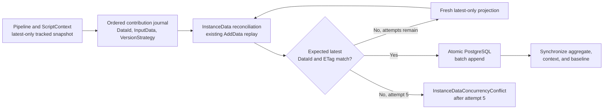

# InstanceData Optimistic Reconciliation Design

**Date:** 2026-07-23

**Status:** Proposed, design approved in principle

**Scope:** Runtime pipeline writes produced through `ScriptContext`, including concurrent instance-to-instance triggers and notifications

## Problem

Runtime instances are loaded latest-only when
`WorkflowExecution:LatestOnlyInstanceLoading` is enabled. This keeps pipeline and script-context
materialization inexpensive because the latest `InstanceData` row contains the complete merged JSON
state. `ScriptContext` then works on an `Instance.CreateSnapshot()` copy so tasks and scripts do not
re-query the instance throughout a transition.

The snapshot can become stale when another request updates the same instance while the original
pipeline is still running. This is most visible when parallel instances trigger or notify each other.
At the end of a task phase, `TransitionExecutionContext.ApplyScriptContextChanges()` currently finds
rows present in the script snapshot but absent from the live aggregate and replays those rows with
their already-derived versions through `Instance.AddDataWithVersion()`.

If the live aggregate has advanced to a higher semantic version, replaying the stale row becomes an
older-line append. A latest-only aggregate does not have the target line's history required for
deduplication and `HistorySequence` calculation, so `AddDataWithVersion()` correctly throws:

```text
Cannot append version '...' to instance '...': the aggregate was loaded latest-only and the target
version line is not in memory.
```

Repeatedly refreshing the complete instance during script execution would reduce staleness but
would remove the performance benefit of snapshot execution. Holding an application or distributed
lock for every `InstanceData` mutation would reduce concurrency and extend pipeline latency.
Restarting the full pipeline after an optimistic conflict is also unsafe because tasks can perform
non-repeatable HTTP, Dapr, notification, or other external side effects.

## Goals

- Preserve latest-only instance loading and snapshot-based `ScriptContext` execution.
- Preserve the current `JsonData.Merge()` and `InstanceData.NewVersion()` semantics exactly.
- Avoid a new pipeline-duration or per-mutation distributed lock.
- Detect a stale base before appending runtime `InstanceData`.
- Reapply only the recorded data contributions to a fresh latest head.
- Retry only the data reconciliation and persistence operation, never the pipeline or tasks.
- Keep conditional validation and batch append atomic at the PostgreSQL boundary.
- Fail the transition with an explicit `InstanceDataConcurrencyConflict` after five conflicts.
- Preserve multi-schema isolation, instance data history, `VersionNo`, and the single-`IsLatest`
  invariant.

## Non-Goals

- Replacing or changing `JsonData.Merge()` behavior.
- Introducing JSON Patch, path-level conflict resolution, or element-level array merging.
- Serializing an entire pipeline with a new data-specific lock.
- Restarting a transition, script, or external task after a data conflict.
- Reconciling explicit older semantic-version-line appends. Those remain full-history operations.
- Changing definition publishing, seed-data publishing, or full-history query APIs.
- Removing the existing PostgreSQL trigger that assigns `VersionNo` and maintains `IsLatest`.

## Existing Semantics That Must Remain Stable

`Instance.AddData()` derives a new row from the current head through
`InstanceData.NewVersion()`. That method:

1. applies the requested `VersionStrategy` to the current head version;
2. computes the new full document through `Data.Merge(inputData)`;
3. demotes the previous in-memory head;
4. creates a new latest row.

The existing merge semantics remain authoritative:

- JSON objects are recursively deep-merged;
- the source wins for a scalar or incompatible value;
- a source array replaces the complete target array;
- the existing null behavior remains unchanged;
- contributions are applied in call order;
- every non-deduplicated `AddData()` call can create its own history/version row.

The reconciliation feature changes only the target head against which these existing operations are
replayed. It does not introduce a second merge implementation.

## Decision

Use snapshot-local contribution journaling plus an optimistic, atomic conditional append:

1. Build a tracked data snapshot for `ScriptContext` from the latest-only aggregate.
2. Record each successful `AddData()` input, strategy, ID, and order in a transient journal while
   preserving the current in-snapshot mutation behavior.
3. At the end of a task phase, conditionally append the prepared rows only if the database latest
   `DataId` and `ETag` still match the snapshot baseline.
4. On conflict, read only the fresh latest `InstanceData` projection.
5. Replay the same ordered contribution journal against that fresh head using the existing domain
   `AddData()` path.
6. Retry the conditional append, up to five total attempts.
7. On success, synchronize the partial aggregate and transition context to the persisted latest
   head and acknowledge the journal.
8. On the fifth conflict, fail the current transition with
   `InstanceDataConcurrencyConflict`. Do not restart the pipeline.

## Architecture



The fast path performs no fresh read. A fresh read occurs only after the database reports that the
expected latest head is stale.

## Domain Model

### Baseline

The baseline identifies the latest row from which the tracked snapshot started:

```csharp
public sealed record InstanceDataBaseline(
    Guid DataId,
    string ETag,
    string Version,
    long VersionNo);
```

The snapshot already contains the baseline JSON. A second standalone copy is not required because
the solution records contribution inputs rather than computing a three-way diff from full output
documents.

### Contribution

```csharp
public sealed record InstanceDataContribution(
    Guid DataId,
    JsonData Input,
    VersionStrategy VersionStrategy,
    int Order);
```

The contribution stores the source payload originally passed to `AddData()`, not the full merged
document produced by the stale snapshot. Replaying a stale full document would overwrite concurrent
fields that the script never intended to change.

`DataId` is generated once and remains stable across reconciliation attempts. `Order` preserves the
observable result of multiple sequential task outputs.

### Change Set

```csharp
public sealed record InstanceDataChangeSet(
    Guid InstanceId,
    InstanceDataBaseline Baseline,
    IReadOnlyList<InstanceDataContribution> Contributions);
```

### Tracked Snapshot

Add an explicit script-context snapshot factory rather than changing every caller of
`CreateSnapshot()`:

```csharp
public Instance CreateTrackedDataSnapshot();
```

The tracked snapshot:

- copies the normal instance and `InstanceData` snapshot state;
- preserves `IsDataPartiallyLoaded`;
- captures the starting latest-row baseline;
- enables a transient contribution journal;
- does not add persisted fields or columns.

`Instance.AddData()` continues to execute its current implementation. After a successful mutation,
the optional tracker records the original ID, source input, resolved strategy, and call order.
Regular aggregates and ordinary snapshots have no tracker, so their behavior and allocation profile
remain unchanged.

Explicit `AddDataWithVersion()` is not converted into a runtime contribution. In particular, an
explicit older-line append on a tracked latest-only snapshot continues to fail and must use the
existing full-history repository contract. The current `ApplyScriptContextChanges()` row-replay path
is removed, so ordinary script/task `AddData()` results no longer become accidental explicit-version
appends.

### Journal Lifecycle

- A new tracked snapshot starts with an empty journal and its current latest baseline.
- Parallel script branches maintain private journals.
- `MergeParallelBranch()` records its resulting `AddData()` contribution in deterministic branch
  order, preserving current merge behavior.
- Successful reconciliation acknowledges the applied entries, clears them, and advances the
  baseline to the persisted latest row.
- Failed reconciliation does not acknowledge or clear entries.
- `RefreshScriptContextInstance()` creates a new tracked snapshot from the authoritative live
  aggregate after previously applied entries have been acknowledged.

## Application Contracts

### Reconciliation Service

```csharp
public interface IInstanceDataReconciliationService
{
    Task<Result<InstanceDataReconciliationResult>> ApplyAsync(
        Instance instance,
        InstanceDataChangeSet changeSet,
        CancellationToken cancellationToken);
}

public sealed record InstanceDataReconciliationResult(
    InstanceData LatestData,
    IReadOnlyList<InstanceData> AppendedData,
    int AttemptCount,
    bool WasRebased);
```

### Script Change Applicator

The three task pipeline steps use one shared orchestration service:

```csharp
public interface IScriptDataChangeApplicator
{
    Task<Result> ApplyAsync(
        TransitionExecutionContext transitionContext,
        ScriptContext scriptContext,
        CancellationToken cancellationToken);
}
```

It replaces direct calls to `TransitionExecutionContext.ApplyScriptContextChanges()` in:

- `RunOnExecuteTasksStep`;
- `RunOnExitTasksStep`;
- `RunOnEntryTasksStep`.

The applicator:

1. reads the pending change set;
2. calls the reconciliation service;
3. updates `TransitionExecutionContext.Data` from the persisted latest JSON;
4. synchronizes the script-context baseline;
5. acknowledges the contribution journal only after success;
6. applies non-data `ScriptContext.Mutations` through their existing path.

Task execution, boundary handling, and lifecycle planning are not repeated during reconciliation.

## Reconciliation Algorithm

The maximum attempt count is five and counts the initial fast-path append.

```csharp
for (var attempt = 1; attempt <= 5; attempt++)
{
    var head = attempt == 1
        ? changeSet.Baseline
        : await repository.GetLatestDataHeadAsync(instance.Id, cancellationToken);

    var prepared = ReplayWithExistingAddData(head, changeSet.Contributions);

    if (prepared.Count == 0)
        return NoChange(head, attempt, wasRebased: attempt > 1);

    var result = await repository.TryAppendDataAsync(
        instance.Id,
        expectedLatestDataId: head.DataId,
        expectedLatestEtag: head.ETag,
        prepared,
        cancellationToken);

    if (result.Status is Applied or NoChange)
        return Success(result, attempt, wasRebased: attempt > 1);

    if (result.Status != Conflict)
        return Failure(result.Error);
}

return Failure(WorkflowErrors.InstanceDataConcurrencyConflict(instance.Id, 5));
```

`ReplayWithExistingAddData` uses a transient latest-only working aggregate seeded with the selected
head. It calls the existing `Instance.AddData()` in contribution order. This reuses the current
deduplication, merge, version-strategy, and history-sequence behavior rather than duplicating those
rules in the reconciliation service.

## Infrastructure Contracts

```csharp
public interface IInstanceDataConcurrencyRepository
{
    Task<InstanceDataHead?> GetLatestDataHeadAsync(
        Guid instanceId,
        CancellationToken cancellationToken);

    Task<ConditionalAppendResult> TryAppendDataAsync(
        Guid instanceId,
        Guid expectedLatestDataId,
        string expectedLatestEtag,
        IReadOnlyList<PreparedInstanceData> data,
        CancellationToken cancellationToken);
}
```

The fresh projection contains only reconciliation fields:

```csharp
public sealed record InstanceDataHead(
    Guid DataId,
    string ETag,
    string Version,
    long VersionNo,
    int HistorySequence,
    JsonData Data);
```

The conditional operation returns a normal control-flow result rather than throwing for a stale
base:

```csharp
public enum ConditionalAppendStatus
{
    Applied,
    NoChange,
    Conflict
}
```

Schema validation, invalid JSON, idempotency violations, cancellation, authorization, and database
availability failures remain errors and are not converted into optimistic conflicts.

## Atomic PostgreSQL Boundary

Introduce a dedicated, schema-local database function conceptually equivalent to:

```sql
try_append_instance_data_batch(
    p_instance_id,
    p_expected_data_id,
    p_expected_etag,
    p_rows
)
```

Within the current transition UoW transaction, the function:

1. enters the same transaction-scoped per-instance serialization boundary already used by the
   `InstancesData` insert trigger;
2. reads the current `IsLatest=true` row;
3. compares its ID and ETag with the expected baseline;
4. returns `Conflict` without writing when either value differs;
5. validates batch idempotency;
6. inserts all prepared rows in contribution order when the expected head matches;
7. returns the inserted metadata needed to synchronize EF and the aggregate.

The function performs no JSON merge and interprets no `VersionStrategy`. All domain calculations
remain in application/domain code.

This does not introduce a pipeline-duration distributed lock. The existing database trigger already
uses a transaction-scoped PostgreSQL advisory lock for `InstanceData` insertion and assigns the
instance-global `VersionNo`. Moving expected-head validation into the same atomic boundary closes
the refresh-to-insert race without adding a separate application lock protocol.

### Batch Semantics

All prepared rows are appended atomically. For three contributions based on fresh head `2.0.0`, the
prepared batch can contain:

```text
2.0.1 IsLatest=false
2.0.2 IsLatest=false
2.0.3 IsLatest=true
```

The database commits all three or none. The existing trigger assigns monotonically increasing
`VersionNo` values and demotes the former latest only when the incoming batch reaches its final
`IsLatest=true` row.

### Idempotency

- Contribution IDs remain stable across attempts.
- If all contribution IDs already exist for the same instance with the expected content, the batch
  is treated as already applied and its persisted rows are returned.
- If only a subset exists, the function reports an idempotency violation; partial replay is never
  accepted.
- If an existing ID has different content, the function reports an idempotency violation.

## EF Core and Aggregate Synchronization

The PostgreSQL function inserts data through raw SQL, so the tracked DbContext and partial aggregate
must be synchronized explicitly without creating duplicate `Added` entities.

Repository responsibilities after a successful append:

1. materialize the returned rows as `InstanceData` entities;
2. register the persisted rows with EF as `Unchanged`;
3. remove or detach the obsolete loaded head from the partial navigation without issuing a delete;
4. synchronize the aggregate's in-memory partial data list to the returned persisted rows;
5. ensure a later `instanceRepository.UpdateAsync()` does not reinsert them.

The domain exposes a narrow internal operation such as:

```csharp
internal void SynchronizePartiallyLoadedData(
    IReadOnlyList<InstanceData> persistedData);
```

The method knows nothing about `EntityState`; EF state management stays in the repository. It is
valid only for a latest-only aggregate and must leave `IsDataPartiallyLoaded=true`.

`GetLatestDataHeadAsync()` uses an `AsNoTracking` projection so EF never satisfies a conflict refresh
from the stale tracked entity.

The reconciliation operation participates in the existing transition `RequiresNew` UoW. It does not
open an independently committed data transaction. Therefore a failed transition does not commit an
`InstanceData` batch independently of the transition UoW.

## Error Policy

Only expected-head changes and explicitly mapped PostgreSQL concurrency/serialization signals are
retryable reconciliation conflicts.

The following are not retried by reconciliation:

- schema validation failure;
- invalid JSON;
- explicit older version-line append;
- partial or inconsistent idempotency state;
- an existing contribution ID with different content;
- authorization or schema-resolution failure;
- database connection failure;
- cancellation.

After the fifth conflict:

```csharp
WorkflowErrors.InstanceDataConcurrencyConflict(instanceId, attempts: 5)
```

is returned. The current pipeline step fails, subsequent lifecycle steps do not execute, and the
transition UoW is not committed. Reconciliation does not automatically re-enter or restart the
pipeline.

The error log contains instance, baseline, observed head, transition, step, attempt, contribution
count, and trace metadata. JSON payloads are never logged.

## Configuration

```json
{
  "WorkflowExecution": {
    "EnableInstanceDataReconciliation": false
  }
}
```

The approved attempt count is a code-level constant of five rather than an operational tuning knob.
This prevents deployments from silently weakening the agreed failure bound. The feature flag permits
a canary rollout. When disabled, the current fail-fast row-replay behavior remains available
temporarily for rollback during deployment.

## Observability

Metrics:

```text
workflow.instance_data.reconciliation.total
workflow.instance_data.reconciliation.conflicts
workflow.instance_data.reconciliation.exhausted
workflow.instance_data.reconciliation.attempts
workflow.instance_data.reconciliation.duration
workflow.instance_data.reconciliation.contributions
```

Allowed low-cardinality labels:

```text
flow
pipeline_step
result = applied | no_change | exhausted | failed
rebased = true | false
```

Instance ID, data ID, ETag, and trace ID are log fields, not metric labels.

Structured conflict logs include:

```text
InstanceId
ExpectedDataId
ObservedDataId
Attempt
ContributionCount
PipelineStep
TransitionKey
TraceId
```

Payload JSON is not logged; a data hash may be used when diagnosis requires content identity.

## Testing

### Domain Tests

- A tracked snapshot records an `AddData()` contribution without changing its merge result.
- Multiple contributions preserve call order.
- A regular aggregate or ordinary snapshot does not allocate or populate a journal.
- A tracked snapshot preserves `IsDataPartiallyLoaded`.
- Acknowledgement clears applied entries and advances the baseline.
- Refresh does not replay acknowledged contributions.
- Existing `InstanceData`, merge, version, array, and null tests remain unchanged and green.

### Application Tests

- Fast path performs one conditional append and no fresh-head query.
- One conflict performs one fresh query, replays contributions, and succeeds on attempt two.
- Five conflicts return `InstanceDataConcurrencyConflict`; attempt six never occurs.
- Task, script, HTTP/Dapr, and notification execution counters remain one while reconciliation
  attempts increase.
- Reconciliation with an unchanged head produces the same JSON and version chain as ordinary
  `AddData()` calls.
- Successful reconciliation updates `TransitionExecutionContext.Data`, advances the script baseline,
  and clears only acknowledged journal entries.
- Failed reconciliation leaves the journal unacknowledged.

### Pipeline Regression Tests

For `RunOnExecuteTasksStep`, `RunOnExitTasksStep`, and `RunOnEntryTasksStep`:

- successful contributions are applied through the common applicator;
- a conflict followed by success does not re-execute the step's tasks;
- five conflicts fail the step with the explicit error and prevent later lifecycle steps;
- non-data `ScriptContext.Mutations` retain their current behavior.

The reported regression is reproduced with a latest-only live aggregate, a stale tracked script
snapshot, and a concurrently advanced latest row. The old direct `AddDataWithVersion()` replay must
throw in the control case; the new reconciliation path must refresh, replay the original
contribution, and succeed without a pipeline restart.

### PostgreSQL Integration Tests

Use real PostgreSQL rather than InMemory EF:

- Two writers starting from the same baseline and changing different object paths both survive in
  final data after one writer rebases.
- Two writers changing the same scalar path produce source-wins/last-atomic-append behavior.
- Concurrent array changes retain whole-array replacement behavior.
- A controlled middle-row batch failure leaves no new rows and preserves the prior latest.
- Repeating an identical batch is idempotent.
- Partial existing IDs and same-ID/different-content cases fail explicitly.
- `VersionNo` is monotonic and exactly one row per instance is `IsLatest=true`.
- The same instance ID in two tenant schemas is isolated by `ICurrentSchema`.

### Performance Checks

- Conflict-free execution adds no fresh latest query.
- The reconciliation projection reads only one latest row and the required JSON payload.
- Fast-path and conflict-path query counts are asserted in integration tests.
- Performance comparison records reconciliation latency and allocations without introducing a
  timing-sensitive pass/fail threshold into ordinary unit tests.

## Rollout

1. Deploy the schema-local atomic append function without enabling callers.
2. Deploy application code with `EnableInstanceDataReconciliation=false`.
3. Enable the feature for canary flows that exercise parallel instance notifications and triggers.
4. Observe conflict rate, attempt histogram, exhausted conflicts, and reconciliation latency.
5. Expand enablement when fast-path ratio remains high and exhausted conflicts remain negligible.
6. After stabilization, remove the legacy snapshot-row `AddDataWithVersion()` replay path and the
   temporary rollback flag in a separate cleanup change.

## Expected Change Surface

Primary production changes:

- `Instance` and/or a focused transient tracker type for tracked snapshots and contribution journal;
- `ScriptContextBuilder`, `ScriptContext.RefreshInstance()`, and parallel branch handling;
- `TransitionExecutionContext` to stop replaying unknown snapshot rows;
- a shared `IScriptDataChangeApplicator` used by the three task pipeline steps;
- `IInstanceDataReconciliationService` and its implementation;
- focused repository contracts and implementation for latest-head projection and conditional append;
- a migration for the schema-local atomic batch append function;
- workflow error code, logging, metrics, options, and validation;
- domain, application, pipeline, and PostgreSQL concurrency tests.

No behavioral rewrite is expected in unrelated transition steps, task executors, notification
dispatch, definition publishing, full-history queries, or the existing merge strategies.

## Acceptance Criteria

- Conflict-free runtime writes do not perform an additional fresh instance read.
- ScriptContext continues to execute on a snapshot.
- Current merge, null, array, deduplication, and version-strategy semantics remain unchanged.
- Runtime contributions are replayed against the fresh latest head rather than replaying stale
  versioned rows.
- Conditional validation and all contribution inserts are one atomic database operation.
- Reconciliation never reruns the pipeline, script, or task side effects.
- Five conflicts return `InstanceDataConcurrencyConflict` and fail the current transition.
- A failed batch leaves no partial rows and does not change the previous latest.
- Exactly one latest row and monotonically increasing `VersionNo` values are preserved.
- The tracked EF aggregate is synchronized without duplicate inserts or accidental deletes.
- Multi-schema isolation is preserved.

## Implementation Verification

Verified on 2026-07-23 at commit `7473841682a7ef255fc48c81d79d9864cc21d3e4`
(branch `codex/instance-data-reconciliation`).

### Formatting

```text
dotnet format BBT.Workflow.slnx --no-restore --include src/BBT.Workflow.Domain/Instances \
  src/BBT.Workflow.Domain/Scripting src/BBT.Workflow.Domain/Execution/Transitions/Context \
  src/BBT.Workflow.Application/Execution/Transitions src/BBT.Workflow.Application/BackgroundJobs/Options \
  src/BBT.Workflow.Infrastructure/Instances src/BBT.Workflow.Infrastructure/Monitoring \
  test/BBT.Workflow.Domain.Tests/Instances test/BBT.Workflow.Domain.Tests/Scripting \
  test/BBT.Workflow.Application.Tests/Execution/Transitions \
  test/BBT.Workflow.Infrastructure.Tests/Domains/Instances
```

Exit code 0; `git diff --stat` empty — no formatting changes were required.

### Test Evidence

```text
dotnet test test/BBT.Workflow.Domain.Tests --no-restore \
  --filter "FullyQualifiedName~InstanceData|FullyQualifiedName~ScriptContext"
Failed: 94, Passed: 97, Skipped: 0, Total: 191
```

All 94 failures are pre-existing harness failures (`AmbientServiceProvider.Current` not
initialized by the old Domain test harness) in `InstanceDataVersionComparerTests` (55),
`InstanceDataTests` (36), and `InstanceTests` (3). The count is unchanged from the plan-start
baseline (88 passed / 94 failed); the plan added 9 passing tests and introduced zero new
failures, so the plan expectation "zero failed" is met for all reconciliation tests added or
modified by this plan.

```text
dotnet test test/BBT.Workflow.Application.Tests --no-restore \
  --filter "FullyQualifiedName~InstanceData|FullyQualifiedName~TaskStepDataReconciliation|FullyQualifiedName~ScriptDataChangeApplicator"
Failed: 2, Passed: 59, Skipped: 0, Total: 61
```

The 2 failures (`InstanceQueryAppServiceVersionTests.GetInstanceDataAsync_WithNullVersion_UsesReadOnlyPath`,
`InstanceQueryAppServiceVersionTests.GetInstanceDataAsync_WithSpecificVersion_UsesFullHistoryPath`)
are pre-existing: the same tests fail identically at the branch merge-base `ae487872`, and no
file they exercise was modified by this plan. Zero new failures.

```text
dotnet test test/BBT.Workflow.Infrastructure.Tests --no-restore \
  --filter "FullyQualifiedName~InstanceDataConditionalAppendFunctionTests|FullyQualifiedName~EfCoreInstanceDataConcurrencyRepositoryTests|FullyQualifiedName~InstanceDataVersioningTests"
Failed: 0, Passed: 22, Skipped: 0, Total: 22
```

Real-PostgreSQL suite fully green.

```text
dotnet build BBT.Workflow.slnx --no-restore
0 Error(s), 15 Warning(s)
```

All 15 warnings are pre-existing and outside the reconciliation change surface (NU1903
`Microsoft.OpenApi` advisory, NU1510 prune hints, and XML-doc/nullable warnings in
`monitoring/BBT.Workflow.Monitor.Application`).

### Canary Activation Sequence

```text
1. Apply migration 20260723120000 to every flow schema.
2. Deploy application with WorkflowExecution:EnableInstanceDataReconciliation=false.
3. Enable only for canary orchestration deployments/flows handling parallel notifications.
4. Watch fast-path ratio, conflicts, attempts, exhausted count, duration, and task execution counters.
5. Roll back callers by setting the flag false; do not drop the database function during rollback.
```

Flag prerequisite: `EnableInstanceDataReconciliation=true` requires
`LatestOnlyInstanceLoading=true`; the combination is validated at startup.

### Deviations

- PostgreSQL serialization/deadlock errors (`40001`/`40P01`) propagate as infrastructure
  failures instead of a retryable `Conflict` result (plan errata recorded in the plan document).
- `ScriptDataChangeApplicator` does not call `SynchronizePartiallyLoadedData`; the repository
  conditional-append path owns tracked-aggregate synchronization.
