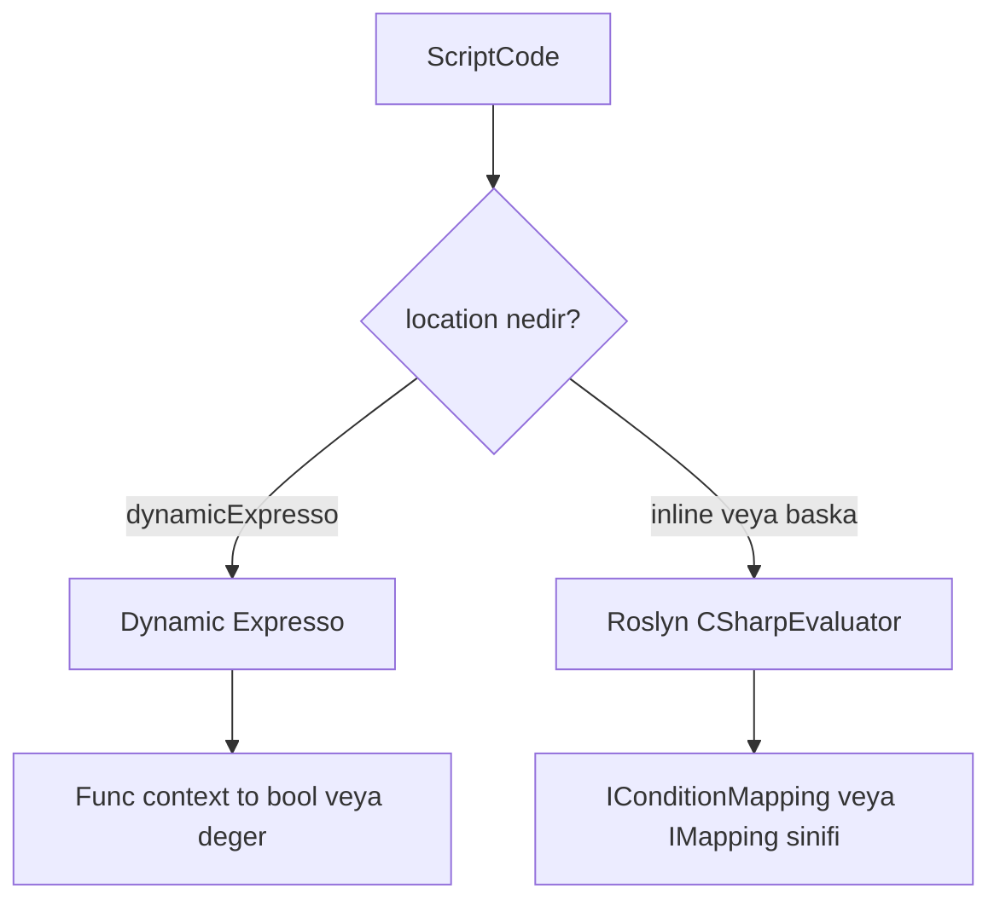
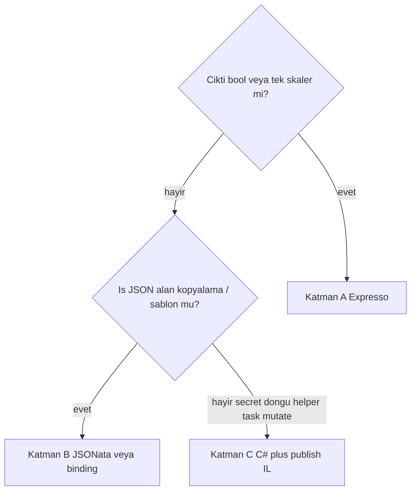

# Script Motoru: Üç Katmanlı Alternatif (Anlatım + Beklenen Kazanç)

**Tarih:** 2026-09-06  
**Durum:** Tasarım önerisi — kod değişikliği yok  
**Kime:** Mimari / runtime okuyucusu (Roslyn maliyeti ve “daha hafif ne olur” sorusu)  
**Kanıt:** [script-compile-measurement-2026-08-27](../../runtime/script-compile-measurement-2026-08-27.md), [component-read-redundancy-analysis](2026-08-25-component-read-redundancy-analysis.md), [script-context-and-engine](../../runtime/script-context-and-engine.md)

Bu sayfa “Roslyn pahalı, yerine ne koyalım?” cevabını **adım adım** açar. Yüzdeler **hangi paydadan** kesildiği yazılmadan verilmez. Tahminler iz ölçümünden türetilmiştir; üretim QPS’i bu repoda yok — aralıklar bu yüzden geniş tutulur.

---

## 1. Önce tek cümle

Roslyn’i “yavaş C#” diye silmek yanlış. Roslyn **ısınmış pod’da zaten hızlı** (~0.02 ms). Pahalı olan, **her yeni süreçte her script kimliğini ilk kez derlemek** (tipik 6–75 ms, helper’lı yolda 1.5 s’ye kadar).

Daha hafif alternatif, **yeni bir genel dil** (Lua, JS) değil. Yazarların zaten yaptığı işi üçe ayırmak:

| Katman | Ne iş | Motor | Yazar ne yazar |
| --- | --- | --- | --- |
| **A** | Evet/hayır, tek değer | Dynamic Expresso (**bugün var**) | `context.Body.status == "Approved"` |
| **B** | JSON’u başka JSON’a çevir | JSONata (öneri, **yok**) | `{ "id": "Body.customerId" }` |
| **C** | Geri kalan gerçek C# | Aynı C#, **istek anında değil publish anında** derlenir | `class X : ScriptBase, IMapping` |

Hedef: istek yolundan Roslyn’i **kaldırmak**, C#’ı **tasarım/yayın anına** itmek.

---

## 2. Bugün runtime ne yapıyor? (iki motor)

Workflow tanımındaki her `ScriptCode` bir `location` taşır.



**Expresso (hafif, mevcut):** [`RoutingConditionEvaluator`](../../../src/BBT.Workflow.Application/Tasks/Evaluators/RoutingConditionEvaluator.cs) `location == "dynamicExpresso"` ise [`DynamicExpressoConditionEvaluator`](../../../src/BBT.Workflow.Application/Tasks/Evaluators/DynamicExpressoConditionEvaluator.cs) çalışır. Metin bir **ifade** olarak parse edilir, `ExpressoRuleContext` (allowlist: Body, Instance, Headers, …) verilir, `bool` döner. AssemblyLoadContext yok, `ScriptBase` yok, `IConditionMapping` sınıfı yok.

**Roslyn (ağır, varsayılan):** `location` boş/`inline` ise tam C# derlenir. Koşul için `IConditionMapping.Handler`, görev için `IMapping.InputHandler` / `OutputHandler`. Helper set varsa ayrı ALC. İlk dokunuşta compiler; sonrakilerde süreç içi cache.

Forge / yazar bugün çoğu kuralı **Roslyn sınıfı** olarak basar. Expresso yolu var ama varsayılan değil. Asıl fatura burada: basit `status == "ok"` bile bir C# tipi oluyor.

---

## 3. Soğuk / sıcak — yüzdelerin bütün anlamı bu

Aynı script, aynı pod:

| | Ne zaman | Ölçülen maliyet |
| --- | --- | --- |
| **Soğuk** | Pod yeni, veya o kimlik hiç derlenmedi (HPA, rollout, ilk istek) | `cache_hit=false`. money-transfer: kural 6–7 ms, mapping 10–220 ms. Büyük iz (2026-08-25): ortalama **75 ms/çağrı**, 34 çağrıda **2553 ms** self-time. Helper’lı kuralda **1553 ms** tek span. |
| **Sıcak** | Aynı süreç, aynı kimlik ikinci+ kez | `cache_hit=true`: **0.01–0.03 ms**. Katman 1 hâlâ compile-API başına ~12.5 µs / ~99 KB alloc (~33 çağrı/instance). |

2026-08-27 deneyi: altı kimlik **yalnız ilk dokunuşta** derlendi; ikinci koşuda 15/15 `cache_hit=true`. Cache bozuk değil — maliyet **süreç ısınması**.

Bu yüzden “%80 hızlanır” demek anlamsızdır. Şunu sormak gerekir:

1. **Soğuk `Script.Compile` süresinin** kaçı gider? (HPA / ilk istek / deploy)
2. **Sıcak uçtan uca isteğin** kaçı gider? (normal üretim, ısınmış replica)

Cevap kabaca: (1) büyük, (2) küçük. Aşağıdaki tablolar bunu sayıya döker.

---

## 4. Üç katman, somut örnekle

Aynı işi üç kez yazalım: “skor ≥ 1500 ise otomatik geç”.

### Katman A — Expresso (koşul)

```csharp
context.Body.creditBureau.kkbScore >= 1500
```

`location: "dynamicExpresso"`. Parse milisaniye altı; sonuç `Func<ExpressoRuleContext, bool>`. Bugün auto-transition `rule` ve cache-aside key için **çalışıyor**. View kuralı, timer ifadesi, basit `IConditionMapping` buraya taşınır.

Taşınmaz: `GetSecret`, helper sınıfı, `await`, çok satırlı kontrol akışı.

### Katman B — JSONata / bağlama (JSON reshape)

Bugünkü tipik `OutputHandler` (Roslyn + `IMapping` + bazen `dynamic` tuzakları):

```csharp
public class CreditMap : ScriptBase, IMapping
{
    public Task<ScriptResponse> InputHandler(WorkflowTask task, ScriptContext context)
        => Task.FromResult(new ScriptResponse());

    public Task<ScriptResponse> OutputHandler(ScriptContext context)
    {
        var result = context.Body;
        return Task.FromResult(new ScriptResponse
        {
            Data = new {
                creditBureau = new {
                    kkbScore = (object?)result?.kkbScore
                }
            }
        });
    }
}
```

Önerilen eşdeğer (derleyici yok):

```json
{
  "creditBureau": {
    "kkbScore": "Body.kkbScore"
  }
}
```

veya JSONata: `{ "creditBureau": { "kkbScore": kkbScore } }` (`Body` kök).

HTTP input için aynı fikir: URL/header şablonu (`https://x/{{Body.customerId}}`) — Scriban yeterli; tam `IMapping` değil.

Katman B’ye giren iş: alan seç, iç içe koy, birleştir, map/filter.  
Girmeyen: `task.Url = …` karmaşık dallanma, secret, `context.Related` ile sorgu, helper set.

Kütüphane adayı: `Jsonata.Net.Native` (JSON-native). Lua/JS değil; yazar “genel dil” değil “projeksiyon” öğrenir. Expresso’daki `location` dual’ı gibi yeni bir `location` (ör. `jsonata`) düşünülür.

### Katman C — C# kaçıș, publish-time IL

Secret, döngü, `WorkflowTask` mutasyonu, `ScriptBase` helper’ları, `IFanOutMapping` gibi zengin kontratlar **C# kalır**. Değişen: **ne zaman** derlendiği.

```text
Bugün:  istek 1 → Roslyn emit (~10–220+ ms) → ALC yükle → cache
Öneri:  Forge/publish → IL artifact (content-hash) → pod sadece Load + Invoke
```

Yazar hâlâ `class X : ScriptBase, IMapping` yazar. İstek yolunda compiler yok. Wasm/Lua gerekmez.

---

## 5. Karar ağacı (yazar / Forge)



Kaba dağılım (banka akışları, iz + tanım okuması; kesin envanter yok):

- Koşul / view kuralı / timer: **~15–25%** kimlik → A
- Task mapping’lerin **~60–80%**’i reshape → B
- Kalan **~20–40%** mapping + ScriptTask + helper → C

money-transfer ölçümü (6 kimlik): 2 kural + 4 mapping. Kurallar soğuk sürenin **%4.4**’ü; mapping’ler **%95.6**. Yani “sadece A” soğuk compile’ı az keser; asıl B+C.

Ters örnek: 1553 ms’lik helper’lı **kural** span’ı A’ya giderse o tek span **~%99** düşer. Ortalama değil, kuyruk.

---

## 6. Beklenen performans (yüzde)

### 6.1 Paydalar — bunu atlama

| Payda | Ne | Tipik büyüklük (kanıt) |
| --- | --- | --- |
| **P1** | Soğuk `Script.Compile` self-time (pod ilk dokunuşları) | 2026-08-25 iz: **2553 ms** / 34 çağrı. money-transfer ilk koşu: **~288 ms** / 6 kimlik. |
| **P2** | Soğuk iş isteği (ilk transition’lar, compile hâlâ içeride) | Aynı izde tek job 0.3–2.3 s; compile o sürenin önemli parçası. |
| **P3** | Sıcak uçtan uca istek (ısınmış replica, cache hit) | Compile **0.01–0.03 ms** × N kimlik → genelde **&lt; 1 ms**. |
| **P4** | Sıcak compile-API sabit maliyeti (Katman 1 öncesi) | ~12.5 µs + ~99 KB × ~33 çağrı/instance ≈ **0.4 ms CPU + ~3.3 MB alloc**. |

Yüzde = “bu paydanın ne kadarı kesilir”. Üretim E2E (P3) ile soğuk compile (P1) **karıştırılmaz**.

### 6.2 Katman katman

Sayılar **beklenen aralık**. Orta değer, “yazar karışımı yukarıdaki kaba dağılım + ölçülen soğuk/sıcak” varsayımı. Gerçek akış envanteri yoksa dar yüzde yalan olur.

#### Katman A — Expresso’yu koşulda varsayılan yap (kodun çoğu hazır)

| Payda | Beklenen düşüş | Neden |
| --- | --- | --- |
| P1 soğuk compile | **%5–20** tipik akış; kuyruk kuralında **%90–99** o span | money-transfer’de kurallar 12.7 / 288 ms (**%4.4**). 1553 ms helper-kural span’ı Expresso’da parse &lt; 1 ms. |
| P2 soğuk istek | **%0–10** tipik; kuyrukta **%30–70** o hop | Yalnız kural derlemesi kesilir; mapping hâlâ Roslyn. |
| P3 sıcak E2E | **~%0–1** | 0.02 ms → Expresso eval ~0.01–0.05 ms; gürültü. |
| P4 alloc | Koşul çağrıları kadar (instance başı birkaç) | `IConditionMapping` compile-API’si yok. |

**Ne demek:** A ucuz ve doğru ilk adım. “Sistem %50 hızlandı” iddiası A’dan **çıkmaz**. Kazanç: kuyruk (devasa kural compile) + Forge’da yanlış varsayılanın düzelmesi.

#### Katman B — Mapping’lerin çoğunu JSONata/binding

Varsayım: soğuk mapping compile süresinin **%70–85**’i B’ye uygun (reshape). money-transfer’de mapping 275 ms’nin büyük parçası `GetIbanHistoryMapping` (220 ms) — bu reshape ise tek kimlik P1’in **%76**’sı.

| Payda | Beklenen düşüş | Neden |
| --- | --- | --- |
| P1 soğuk compile | **%60–85** (yalnız B, A’sız) | 10–220 ms Roslyn → ~0.2–2 ms parse. 2026-08-25 ort. 75 ms’lik çağrıların çoğu mapping ise aynı oran. |
| P2 soğuk istek | **%15–40** compile-ağır hop’larda | İlk job’larda compile self-time başat; B onu siler. I/O (HTTP task) baskın hop’ta yüzde küçülür. |
| P3 sıcak E2E | **%0–3** | Execute zaten ucuz. Interpreter vs IL: tek mapping’de mikrosaniye–ondalık ms. Kazanç asıl **alloc/GC** (P4). |
| P4 alloc | B’ye giden çağrılarda **~%70–90** | Roslyn `CompileToInstanceAsync` hit yolu yok. |

**Ne demek:** B, soğuk compile’ın asıl kesici. HPA’da her yeni pod’un “ilk müşteri 2 s bekledi” şikayetinin hedefi.

#### Katman C — Kalan C# publish-time IL

Kalan ~%15–30 kimlik (karmaşık mapping, helper, ScriptTask).

| Payda | Beklenen düşüş | Neden |
| --- | --- | --- |
| P1 soğuk compile (kalan C# kimlikler) | **%90–98** o kimliklerde | Emit 10–220+ ms → assembly load ~1–5 ms (paylaşımlı artifact ile). |
| P1 soğuk compile (tüm kimlikler, yalnız C) | **%10–30** | A+B yapılmadıysa büyük mapping’ler hâlâ runtime’da. |
| P2 soğuk istek | A+B sonrası artan: **%5–15** | Kalan kuyruk. |
| P3 sıcak E2E | **~%0–1** | Load+invoke ≈ bugünkü hit. |
| P4 alloc | C kimliklerinde compile-API kalkarsa **orta** | Hit yolu zaten ucuz; asıl kazanç soğuk. |

**Daha ucuz yarı-C:** publish IL yok, **startup warmup** (tüm referanslı script’leri boot’ta derle). P1 müşteri isteğinden **pod hazırlığına** kayar. P2 kullanıcı-görünür soğuk **~%80–100** düzelir; P1 toplam CPU aynı kalır. 2026-08-27 tavsiyesi de buydu. C, warmup’ın kalıcı hali: CPU’yu publish/CI’ya taşır, replica başına tekrarlamaz.

### 6.3 Birlikte (A + B + C) — özet kart

Varsayım: kimliklerin ~%20’si A, ~%65’i B, ~%15’i C; soğuk süre mapping ağırlıklı (money-transfer ve 2026-08-25 izine uyumlu).

| Payda | Beklenen toplam düşüş | Tek cümle |
| --- | --- | --- |
| **P1 soğuk `Script.Compile`** | **%90–99** | İstek yolunda neredeyse hiç Roslyn emit yok. 2553 ms → onlarca ms load/parse. |
| **P2 soğuk ilk istek** | **%20–50** compile-ağır senaryoda; I/O-ağırda **%5–15** | 2026-08-25’te compile self-time başattı; her hop HTTP ise yüzde küçülür. |
| **P3 sıcak E2E** | **%0–5** (çoğu akışta **%0–2**) | Sıcak compile zaten 0.02 ms. Görünür kazanç GC (P4) ve kuyruk yokluğu. |
| **P4 alloc / compile-API** | **%70–95** | 33×99 KB hit-yolu A/B’de yok; C precompile’da yok. |
| **HPA / rollout (N pod)** | P1 × N **tekrarlanmaz** | Bugün her replica kendi soğuk compile’ını öder. Artifact + warmup ile bir kez (veya sıfır, publish’te). |

2026-08-25 izini düz sayıyla örneklersek (yalnız mertebe): `Script.Compile` 2553 ms. A+B+C sonrası P1 ≈ 50–150 ms parse/load varsayımı → **P1 ≈ %94–98 kesinti**. Aynı izdeki `Instance.Load` (593 ms) ve generation-token (369 ms) **bu işle düşmez** — bu yüzden soğuk **tüm** iş isteği %94 olmaz; P2 %20–50 aralığı bu.

### 6.4 Bilerek vaat etmediğimiz şeyler

- Sıcak p99’u “iki kat hız” — kanıt yok; sıcak darboğaz compile değil (`Instance.Load`, Redis generation token, Dapr hop).
- Lua/JS’e geçince hem soğuk hem sıcak kazanmak — interpreter sıcak execute’da IL’den **yavaş** olabilir.
- Expresso ile `IMapping`’i bitirmek — kontrat uymuyor.
- `performance-profiles.json` dolmadan Forge’un bu yüzdeleri kapı olarak kullanması.

---

## 7. Neden Lua / JS / JSON-Logic değil?

| Aday | Soğuk | Sıcak execute | Yazar | Karar |
| --- | --- | --- | --- | --- |
| Lua / MoonSharp | İyi | IL’den yavaş | Banka C# | Hayır — `ScriptBase`/`IMapping` taşınmaz. |
| V8 / ClearScript | Orta | Ağır runtime | Yeni dil | Hayır. |
| JSON-Logic | İyi | İyi | Predicate | A’nın zayıf kopyası; Expresso varken gerek yok. |
| CEL | İyi | İyi | Yeni dil | A için standart; Expresso zaten oturmuş. |
| **Expresso** | İyi | Yeter | C# ifadesi | **A — mevcut.** |
| **JSONata / binding** | İyi | Yeter | Projeksiyon | **B — öneri.** |
| **C# + publish IL** | Soğuk istekte yok | En iyi | Aynı C# | **C.** |

---

## 8. Uygulama sırası (bu spec kod yazmaz)

1. **A (düşük risk):** Forge + validator’da `rule` / view / timer default `dynamicExpresso`. Mevcut Roslyn koşulları kırmadan paralel. Ölç: `Script.Compile` miss sayısı ve kural span’ları.
2. **Warmup (C’nin ucuz yarısı):** Publish veya pod ready’de referanslı kimlikleri derle. P2’yi C’den önce büyütür. [Pod readiness warmup](2026-08-25-pod-readiness-warmup-design.md) ile hizala.
3. **B:** `location=jsonata` (ad tartışılır), dual evaluator, Forge projeksiyon editörü. En büyük P1 kesici.
4. **C:** `sys-mappings` / publish artifact (content-hash → DLL), runtime load. Helper-set ALC pin’i burada kapanır.

Kırılma politikası (Katman 0 ile aynı): eski Roslyn inline **kaldırılmaz**; yeni default eklenir, deprecation sonra.

---

## 9. Doğrulama (yapılırsa)

- Makro: vnext-example `script-perf-lab` + money-transfer. Run1 soğuk / Run2 sıcak (2026-08-27 yöntemi).
- Metrik: `vnext.script.cache_hit`, compile duration histogram **yalnız miss**, katman label (`expresso` / `jsonata` / `csharp`).
- Başarı kriteri (öneri, lab’da kanıtlanacak):
  - Isınmış Run2: `cache_hit=true` oranı %100 (bugün olduğu gibi) **veya** A/B kimliklerinde `Script.Compile` span yok.
  - Soğuk P1: A+B+C sonrası money-transfer ilk-dokunuş compile toplamı **&lt; 20 ms** (bugün ~288 ms) → P1 **≥ %90**.
  - Sıcak P3: money-transfer E2E regressyon **&lt; %3** (interpreter sapması).

---

## 10. İlgili

- [Script Context and Engine](../../runtime/script-context-and-engine.md) — bugünkü sınırlar
- [Script.Compile measurement 2026-08-27](../../runtime/script-compile-measurement-2026-08-27.md) — soğuk vs sıcak kanıt
- [Katman 1 hit-yolu](2026-08-23-script-perf-katman1-design.md) — 12.5 µs / 99 KB
- [Component read redundancy](2026-08-25-component-read-redundancy-analysis.md) — 75 ms × 34 compile
- Kod: `ConditionScriptLocations`, `DynamicExpressoConditionEvaluator`, `IMapping`, `IConditionMapping`, `CSharpEvaluator`
